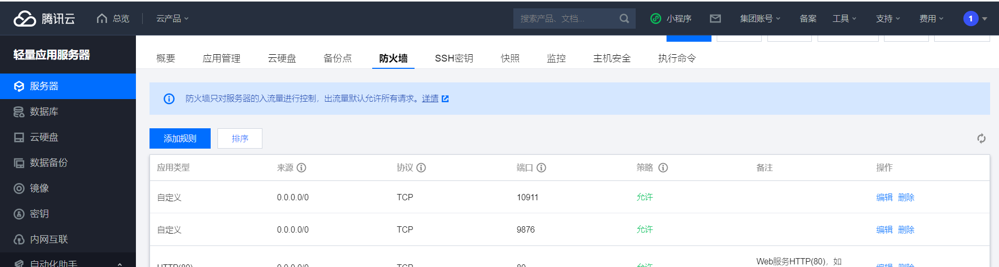
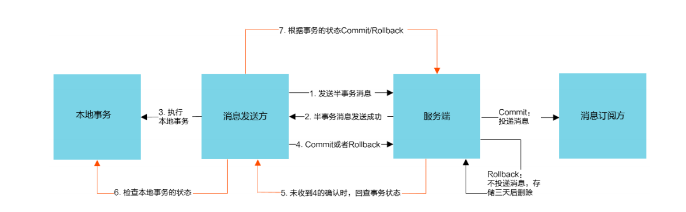
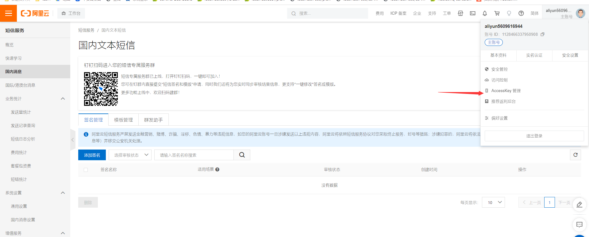
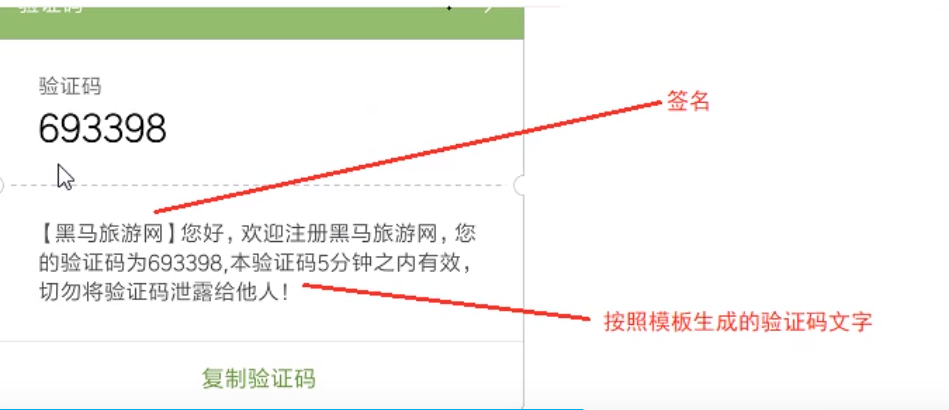
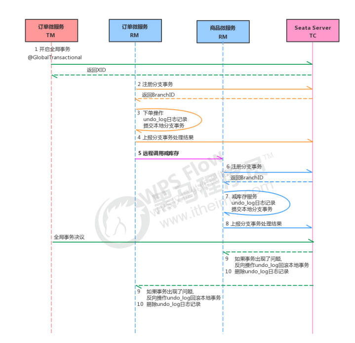
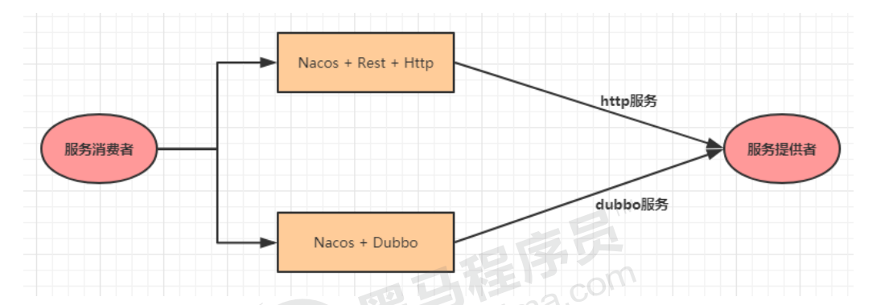

## 主要功能：
- **服务限流降级:** 默认支持WebServlet、webFlux，OpenFeign、RestTemplate、Spring Cloud Gateway,Zuul，Dubbo和RocketMQ限流降级功能的接入，可以在运行时通过控制台实时修改限流降级规则，还支持查看限流降级 Metrics 监控。
- **服务注册与发现:** 适配Spring Cloud服务注册与发现标准，默认集成了Ribbon的支持。
- **分布式配置管理:** 支持分布式系统中的外部化配置，配置更改时自动刷新。 
- **消息驱动能力:** 基于Spring Cloud Stream为微服务应用构建消息驱动能力。
- **分布式事务:** 使用@GlobalTransactional注解，高效并且对业务零侵入地解决分布式事务问题。
- **阿里云对象存储:** 阿里云提供的海量、安全、低成本、高可靠的云存储服务。支持在任何应用、任何时间、任何地点存储和访问任意类型的数据。
- **分布式任务调度:** 提供秒级、精准、高可靠、高可用的定时(基于Cron表达式）任务调度服务。同时提供分布式的任务执行模型，如网格任务。网格任务支持海量子任务均匀分配到所有Worker (schedulerx-client)上执行。
- **阿里云短信服务:** 覆盖全球的短信服务，友好、高效、智能的互联化通讯能力，帮助企业迅速搭建客户触达通道。

## 主要组件：
- **sentinel:** 把流量作为切入点，从流量控制、熔断降级、系统负载保护等多个维度保护服务的稳定性。
- **Nacos:** 一个更易于构建云原生应用的动态服务发现、配置管理和服务管理平台。
- **RocketMQ:** 一款开源的分布式消息系统，基于高可用分布式集群技术，提供低延时的、高可靠的消息发布与订阅服务。
- **Dubbo:** Apache Dubbo是一款高性能Java RPC框架。
- **Seata:** 阿里巴巴开源产品，一个易于使用的高性能微服务分布式事务解决方案。（本次没用到）
- **Alibaba Cloud ACM:** 一款在分布式架构环境中对应用配置进行集中管理和推送的应用配置中心产品。
- **Alibaba Cloud OSS:** 阿里云对象存储服务(Object Storage Service，简称OSS)，是阿里云提供的海量、安全、低成本、高可靠的云存储服务。您可以在任何应用、任何时间、任何地点存储和访问任意类型的数据。
- **阿里云短信服务:** 覆盖全球的短信服务，友好、高效、智能的互联化通讯能力，帮助企业迅速搭建客户触达通道。
- **Alibaba Cloud SchedulerX:** 阿里中间件团队开发的一款分布式任务调度产品，提供秒级、精准、高可靠、高可用的定时(基于Cron表达式)任务调度服务。
- **Alibaba Cloud SMS:** 覆盖全球的短信服务，友好、高效、智能的互联化通讯能力，帮助企业迅速搭建客户触达通道。

## 项目讲解
    springcloud-alibaba父工程
    shop-common公共模块【实体类】
    shop-user用户微服务【端口:807x】
    shop-product商品微服务【端口:808x】
    shop-order订单微服务【端口: 809x】

## 父工程pom
```xml
<?xml version="1.0" encoding="UTF-8"?>
<project xmlns="http://maven.apache.org/POM/4.0.0"
         xmlns:xsi="http://www.w3.org/2001/XMLSchema-instance"
         xsi:schemaLocation="http://maven.apache.org/POM/4.0.0 http://maven.apache.org/xsd/maven-4.0.0.xsd">
 `    <modelVersion>4.0.0</modelVersion>

    <groupId>org.example</groupId>
    <artifactId>springcloud-alibaba</artifactId>
    <packaging>pom</packaging>
    <version>1.0-SNAPSHOT</version>
    <modules>
        <module>api-gateway</module>
        <module>shop-common</module>
        <module>shop-order</module>
        <module>shop-product</module>
        <module>shop-user</module>
        <module>shop-product-8082</module>
    </modules>

<!--    父工程-->
    <parent>
        <groupId>org.springframework.boot</groupId>
        <artifactId>spring-boot-starter-parent</artifactId>
        <version>2.1.3.RELEASE</version>
<!--        <version>2.3.12.RELEASE</version>-->
        <relativePath/> <!-- lookup parent from repository -->
    </parent>

  
    <!--依赖版本的锁定-->
    <properties>
        <maven.compiler.source>8</maven.compiler.source>
        <maven.compiler.target>8</maven.compiler.target>

        <java.version>1.8</java.version>
        <project.build.sourceEncoding>UTF-8</project.build.sourceEncoding>
        <project.reporting.outputEncoding>UTF- 8</project.reporting.outputEncoding>
        <cloud.version>Greenwich.RELEASE</cloud.version>
        <alibaba.version>2.1.1.RELEASE</alibaba.version>
    </properties>

    <dependencyManagement>
        <dependencies>
            <dependency>
                <groupId>org.springframework.cloud</groupId>
                <artifactId>spring-cloud-dependencies</artifactId>
                <version>${cloud.version}</version>
                <type>pom</type>
                <scope>import</scope>
            </dependency>
            <dependency>
                <groupId>com.alibaba.cloud</groupId>
                <artifactId>spring-cloud-alibaba-dependencies</artifactId>
                <version>${alibaba.version}</version>
                <type>pom</type>
                <scope>import</scope>
            </dependency>
        </dependencies>
    </dependencyManagement>

    <dependencies>
        <dependency>
            <groupId>org.springframework.cloud</groupId>
            <artifactId>spring-cloud-starter-sleuth</artifactId>
        </dependency>
        <dependency>
            <groupId>org.springframework.cloud</groupId>
            <artifactId>spring-cloud-starter-zipkin</artifactId>
        </dependency>
    </dependencies>
</project>
```

数据持久层用的是jpa

在yml中:
jpa.hibernate.hbm2ddl.auto
它包含4个属性:
- create : 会根据你的model类来生成表,但是每次运行都会删除上一次的表,重新生成表,哪怕2次没有任何改变
- create-drop : 根据model类生成表,但是sessionFactory一关闭,表就自动删除
- update : 最常用的属性，也根据model类生成表,即使表结构改变了,表中的行仍然存在,不会删除以前的行
- validate : 只会和数据库中的表进行比较,不会创建新表,但是会插入新值


解决Spring Cloud 注册nacos 启动报错：failed to req API:/nacos/v1/ns/instance after all servers([192.168.43.148:8848]) tried: ErrCode:503, ErrMsg:server is DOWN now, please try again later!
报错信息：
com.alibaba.nacos.api.exception.NacosException: failed to req API:/nacos/v1/ns/instance after all servers([192.168.43.148:8848]) tried: ErrCode:503, ErrMsg:server is DOWN now, please try again later!

2.原因：
原因是nacos服务器过载，
3.解决方案：
删掉nacos文件夹下的data文件夹再重启Nacos即可解决


## 项目运行步骤
1.运行nacos   双击运行bin目录下的startup.cmd即可。

2. sentinel    java -Dserver.port=8080 -Dcsp.sentinel.dashboard.server=localhost:8080 -Dproject.name=sentinel-dashboard -jar sentinel-dashboard-1.7.0.jar

[缓存可不开]
3.双击 elasticsearch.bat 启动
4.启动zipkin java -jar zipkin-server-2.12.9-exec.jar --STORAGE_TYPE=elasticsearch --ES-HOST=localhost:9200

5.启动RocketMQ
- 切换到安装目录里的bin目录
- 启动NameServer
  [root@heima bin]# nohup ./mqnamesrv &   # 只要进程不报错,就应该是启动成功了,可以查看一下日志
  [root@heima bin]# tail -f /root/logs/rocketmqlogs/namesrv.log
- 启动Broker
  [root@heima bin]# nohup sh ./mqbroker -n localhost:9876 -c ../conf/broker.conf &
  [root@heima bin]# tail -f /root/logs/rocketmqlogs/broker.log

- 关闭RocketMQ
  [root@heima bin]# ./mqshutdown broker
  [root@heima bin]# ./mqshutdown namesrv


7 在启动了mq之后，在 rocketmq-console目录下cmd：
[java -jar target/rocketmq-console-ng-1.0.0.jar] ==》 http://localhost:7777/#/


## ---------------------------------------------------------------------------------
# 一，Nacos Discovery--服务治理
- 服务注册:在服务治理框架中,都会构建一个注册中心,每个服务单元向注册中心登记自己提供服务的详细信息。并在注册中心形成一张服务的清单,服务注册中心需要以心跳的方式去监测清单中的服务是否可用,如果不可用,需要在服务清单中剔除不可用的服务。
- 服务发现:服务调用方向服务注册中心咨询服务,并获取所有服务的实例清单,实现对具体服务实例的访问。
#### 常见注册中心:
    Zookeeper:是一个分布式服务框架,是Apache Hadoop的一个子项目,它主要是用来解决分布式应用中经常遇到的一些数据管理问题,如:统一命名服务、状态同步服务、集群管理、分布式应用配置项的管理等
    Eureka:是Springcloud Netflix中的重要组件,主要作用就是做服务注册和发现。但是现在已经闭源. Consul
    Consul:是基于GO语言开发的开源工具，主要面向分布式，服务化的系统提供服务注册、服务发现和配置管理的功能。Consul的功能都很实用，其中包括:服务注册/发现、健康检查、Key/Value存储、多数据中心和分布式一致性保证等特性。Consul本身只是一个二进制的可执行文件，所以安装和部署都非常简单
        只需要从 官网下载后，在执行对应的启动脚本即可。
    Nacos:是一个更易于构建云原生应用的动态服务发现、配置管理和服务管理平台。它是Spring Cloud Alibaba组件之一,负责服务注册发现和服务配置,可以这样认为nacos=eureka+config。

## 1服务注册到Nacos
##### 1.1 首先安装、部署、运行 nacos，
    安装Nacos安装
    双击运行bin目录下的startup.cmd即可。
    nacos的控制台界面地址：http://localhost:8848/nacos 或 http://192.168.0.4:8848/nacos/index.html，默认用户名密码都是nacos

##### 1.2 注册微服务,在消费者和提供者的微服务模块的pom文件下增加依赖：
```xml
    <dependency>
        <groupId>com.alibaba.cloud</groupId>
        <artifactId>spring-cloud-starter-alibaba-nacos-discovery</artifactId>
    </dependency>
    <dependency>
        <groupId>com.alibaba.cloud</groupId>
        <artifactId>spring-cloud-starter-alibaba-nacos-config</artifactId>
    </dependency>
```
##### 1.3 在消费者和提供者的微服务模块的启动类上都添加注解 @EnableDiscoveryClient 

##### 注意使用nacos时RestTemplate需要注释掉@LoadBalanced否则会出现错误
    java.lang.IllegalStateException: No instances available for 192.168.0.4

## ---------------------------------------------------------------------------------
## 2负载均衡，服务端常见的是Nginx，客户端（消费者）的是ribbon
#### Nginx和ribbon两者的区别
    Nginx是属于服务器端的负载均衡，Ribbon是属于客户端的负载均衡，
    简而言之，Nginx的客户端发起请求不知道会被负载到哪台服务器上，
    但是Ribbon发起的请求都是非常明确的，就像调用本地服务一样，
    更广的范围说：Nginx是进程之间调用时候做的负载均衡，Ribbon是进程内部选择调用时候做的负载均衡
#### ribbon主要作用
    ribbon主要负责请求分发，例如一个服务节点集群：六台服务器部署着订单服务，用户请求过来了就要根据不同的负载策略分发请求到不同机器上，起到一个缓解请求压力的作用。
    其自身不会发起请求，这个在源码中可以到，它起到一个“选择”的角色。真正发起请求的还是Feign / OpenFeign 。

#### ribbon负载均衡策略：
    （1）RoundRobinRule轮询（默认）：
    （2）RandomRule随机 只知道返回存活服务列表中的随机一个服务的下标，然后在存活列表upList.get(index) 这样去拿到随机的server返回：
    （3）RetryRule轮询重试（重试采用的默认也是轮询）
    （4）WeightedResponseTimeRule响应速度决定权重：
        这个源码很长很复杂，就不放出来了，其实是对RoundRobbin的一种增强，加入了权重和计算响应时间的概念，其中响应速度最快的权重越大，权重越大则选中的概率越大。
    （5）BestAvailableRule最优可用（底层也有RoundRobinRule）：最优可用，判断最优其实用的是并发连接数。选择并发连接数较小的server发送请求。
    （6）AvailabilityFilteringRule可用性过滤规则（底层也有RoundRobinRule）：
        可用过滤规则，其实它功能是先过滤掉不可用的Server实例，再选择并发连接最小的实例。
    （7）ZoneAvoidanceRule区域内可用性能最优：
        基于AvailabilityFilteringRule基础上做的，首先判断一个zone的运行性能是否可用，剔除不可用的区域zone的所有server，然后再利用AvailabilityPredicate过滤并发连接过多的server。

##### 2.1 ribbon依赖被兼容在nacos中

##### 2.2 在RestTemplate方法上加注解 @LoadBalanced   //ribbon实现负载均衡

##### 2.3 在shop-order配置文件application.yml添加配置
```yaml
service-product: # 调用的提供者的名称
        ribbon:
        NFLoadBalancerRuleClassName: com.netflix.loadbalancer.RandomRule   #ribbon负载策略
```

## ---------------------------------------------------------------------------------

## 3发起请求的还是Feign/OpenFeign。feign组件

##### 3.1 在shop-order的pom.xml导入依赖
```xml
<!--feign组件-->
<dependency>
	<groupId>org.springframework.cloud</groupId>
	<artifactId>spring-cloud-starter-openfeign</artifactId>
</dependency>
```
##### 3.2 在ShopOrderApplication启动类上添加feign的注解：@EnableFeignClients//开启feign

##### 3.3 在shop-order项目下的service创建一个ProductService接口， 实例代码：
```java
//value用于指定调用nacos下哪个微服务
//fallback 指定当调用出现问题之后,要进入到哪个类中的同名方法之下执行备用逻辑
@FeignClient(
        value = "service-product"//,
        //fallback = ProductServiceFallback.class,
        //fallbackFactory = ProductServiceFallbackFactory.class
)
public interface ProductService {
    //@FeignClient的value +  @RequestMapping的value值  其实就是完成的请求地址  "http://service-product/product/" + pid
    //指定请求的URI部分
    @RequestMapping("/product/{pid}")
    Product findByPid(@PathVariable Integer pid);

}
```
##### 3.4 OrderController代码
```java
public class OrderController {
    //下单--feign
    @RequestMapping("/order/prod/{pid}")
    public Order order(@PathVariable("pid") Integer pid) {
        log.info("接收到{}号商品的下单请求,接下来调用商品微服务查询此商品信息", pid);

        //调用商品微服务,查询商品信息
        Product product = productService.findByPid(pid);

        if (product.getPid() == -100) {
            Order order = new Order();
            order.setOid(-100L);
            order.setPname("下单失败");
            return order;
        }

        log.info("查询到{}号商品的信息,内容是:{}", pid, JSON.toJSONString(product));

        //下单(创建订单)
        Order order = new Order();
        order.setUid(1);
        order.setUsername("测试用户");
        order.setPid(pid);
        order.setPname(product.getPname());
        order.setPprice(product.getPprice());
        order.setNumber(1);

        orderService.createOrder(order);

        log.info("创建订单成功,订单信息为{}", JSON.toJSONString(order));
        return order;
    }
}
```

# ---------------------------------------------------------------------------------
## 二 服务雪崩效应以及服务容错
    由于tomcat等服务器支持的最大线程数有限，如果一个服务出现了问题，调用这个服务的服务器就会出现线程阻塞的情况，此时如果有大量请求进入，就会导致服务瘫痪，这个服务器上的其他接口也不能调用，继而导致其他服务也会阻塞，瘫痪。
    这种传播就是服务雪崩效应。我们无法完全杜绝雪崩源头的发生，只有做好足够的容错，保证在一个服务发生问题，不会影响到其它服务的正常运行。也就是＂雪落而不雪崩＂。
    服务容错：常见的容错思路有隔离、超时、限流、熔断、降级这几种。
    降级：类似于try/catch，在服务接口级别的try/catch
#### 容错组件有：Hystrix，Resilience4J，Sentinel。
- Hystrix是由Netflix开源的一个延迟和容错库，用于隔离访问远程系统、服务或者第三方库，防止级联失败，从而提升系统的可用性与容错性。
- Resilience4J一款非常轻量、简单，并且文档非常清晰、丰富的熔断工具，这也是***Hystrix***官方推荐的替代产品。不仅如此，Resilience4J还原生支持Spring Boot 1.x/2.x，而且监控也支持和prometheus等多款主流产品进行整合。
- Sentinel是阿里巴巴开源的一款断路器实现，本身在阿里内部已经被大规模采用，非常稳定。

#### 常见的容错思路有隔离、超时、限流、熔断、降级这几种，下面分别介绍一下。
- **隔离：** 能将问题和影响隔离在某个模块内部，而不扩散风险，不波及其它模块，不影响整体的系统服务。常见的隔离方式有:线程池隔离和信号量隔离.
- **超时：** 在上游服务调用下游服务的时候，设置一个最大响应时间，如果超过这个时间，下游未作出反应，就断开请求，释放掉线程。
- **限流：** 限流就是限制系统的输入和输出流星已达到保护系统的目的。为了保证系统的稳固运行,一旦达到的需要限制的阈值,就需要限制流量并采取少量措施以完成限制流量的目的。
- **熔断：** 在互联网系统中，当下游服务因访问压力过大而响应变慢或失败，上游服务为了保护系统整体的可用性可以暂时切断对下游服务的调用。这种牺牲局部，保全整体的措施就叫做熔断。
  - 熔断关闭状态(Closed):服务没有故障时，熔断器所处的状态，对调用方的调用不做任何限制。
  - 熔断开启状态(Open)后续对该服务接口的调用不再经过网络，直接执行本地的fallback方法。
  - 半熔断状态.(Half-Open)尝试恢复服务调用，允许有限的流星调用该服务，并监控调用成功率。如果成功率达到预期，则说明服务已恢复，进入熔断关闭状态;如果成功率仍旧很低，则重新进入熔断关闭状态。
- **降级：** 降级其实就是为服务提供一个托底方案，一旦服务无法正常调用，就使用托底方案。


#### 从流量控制、熔断降级、系统负载保护展开使用sentinel
#### Sentinel具有以下特征:**
- 丰富的应用场景: Sentinel 承接了阿里巴巴近10年的双十—大促流量的核心场景,例如秒杀(即突发流量控制在系统容量可以承受的范围)、消息削峰填谷、集群流量控制、实时熔断下游不可用应用等。
- 完备的实时监控: Sentinel提供了实时的监控功能。通过控制台可以看到接入应用的单台机器秒级数据,甚至500台以下规模的集群的汇总运行情况。
- 广泛的开源生态: Sentinel提供开箱即用的与其它开源框架/库的整合模块,例如与Spring Cloud、Dubbo、gRPC的整合。只需要引入相应的依赖并进行简单的配置即可快速地接入Sentinel。
- 完善的SPI扩展点: Sentinel提供简单易用、完善的SPI扩展接口。您可以通过实现扩展接口来快速地定制逻辑。例如定制规则管理、适配动态数据源等。
#### Sentinel分为两个部分:
- 核心库（Java客户端）不依赖任何框架/库,能够运行于所有Java运行时环境，同时对Dubbo / Spring Cloud等框架也有较好的支持。
- 控制台(Dashboard)基于Spring Boot开发，打包后可以直接运行，不需要额外的Tomcat 等应用容器。


##### Sentinel预设五种规则
- 流控规则
  - 资源名 /order/message1
  - 阈值类型QPS： 每秒查询率
  - 阈值类型 线程数： 最大并发线程
  - 单机阈值 2 ： 每秒允许两次查询
- 降级规则
  - 降级策略：RT：一秒内的请求平均响应时间，时间窗口：等待的时间；
  - 异常比例：一秒内的请求异常的数量/请求总数量，时间窗口：等待时间；
  - 异常数：一分钟产生的异常个数，时间窗口：等待时间（需要大于60s）
- 热点规则 ：带参数的流控规则
- 系统规则 ：服务器维度的流控。
- 授权规则 ：判断请求头/参数，确定是否为白名单/黑名单，下面是一个配置类，,请求发出的时候的该类就可以从url上获取request域的源标识。


##### 4.1 在shop-order的pom中导入依赖（容错在上游服务上，调用者）
```xml
<!--sentinel 服务熔断和降级-->
<dependency>
    <groupId>com.alibaba.cloud</groupId>
    <artifactId>spring-cloud-starter-alibaba-sentinel</artifactId>
</dependency>
```
##### 4.2 Sentinel控制台需要启动jar包 sentinel-dashboard-1.7.0.jar
###### 打开jar包所在的文件夹，cmd ,输入命令
```text
java -Dserver.port=8080 -Dcsp.sentinel.dashboard.server=localhost:8080 -Dproject.name=sentinel-dashboard -jar sentinel-dashboard-1.7.0.jar

port端口号，ashboard.server 定义好的sentinel控制台服务的地址 ，Dproject.name项目名称
```
##### 4.3 访问localhost:8080 进入控制台 ( 默认用户名密码是sentinel/sentinel )
###### 注：需要微服务访问一次，才能刷新加载出微服务的资源信息。

##### 4.4 修改配置（每个集成了Sentinel的微服务模块都要加）：
```yaml
spring:
  cloud:
    sentinel:
      transport:
        port: 9999 #跟控制台交流的端口,随意指定一个未使用的端口即可
        dashboard: localhost:8080 # 指定控制台服务的地址
```
##### 4.5 此时访问http://localhost:8091/order/message1  会在Sentinel控制台的实时监控里看到图表

##### 4.6 在Sentinel控制台的流控规则里新增流控规则   ----------------------限流
- 资源名 /order/message1
- 阈值类型QPS： 每秒查询率
- 单机阈值 2 ： 每秒允许两次查询

###### 再次/order/message1，每秒访问次数达到上限就会显示 **Blocked by Sentinel (flow limiting)**
##### ----------------------
#### 降级，流控，熔断的区别：
    流控超过频率就把请求完全屏蔽等频率降下来就继续提供服务，
    降级超过频率采用备用服务或者丢弃部分资源，等待一定时间以后继续提供服务。 
    熔断直接停用服务，等一段时间后再去尝试是否可以调用服务。

#### 流控规则之高级配置-链路 ***通过在service中设置流控属性值*** 
#### 流控规则
  - 资源名 /order/message1
  - 阈值类型QPS： 每秒查询率
  - 阈值类型 线程数： 最大并发线程
  - 单机阈值 2 ： 每秒允许两次查询

### 应用并不多，了解就好
##### 4.7 在shop-order的service包中创建一个OrderSentinelServiceImpl.java
```java
@Service
@Slf4j
public class OrderSentinelServiceImpl {
    
    //定义一个资源
    //定义当资源内部发生异常的时候的处理逻辑
    @SentinelResource(
            value = "message"    //指定message为资源名
    )
    public String message() {
        return "message";
    }
}
```
##### 4.8 通过在controller包中OrderControllerSentinel
```java
@RestController
@Slf4j
public class OrderControllerSentinel {

    @Autowired
    private OrderSentinelServiceImpl orderSentinelService;
    
    @RequestMapping("/order/message1")
    public String message1() {
      orderSentinelService.message();  //调用
        return "message1";
    }

    @RequestMapping("/order/message2")
    public String message2() {
      orderSentinelService.message();
        return "message2";
    }
}

```
##### 4.9 在高级设置里  流控模式=>链路，阈值=>1,需要改cloudAlibaba版本
```text
<alibaba.version>2.1.1.RELEASE</alibaba.version>
```

###### 将不用的nacos-config依赖注释掉
```xml
<!--        <dependency>-->
<!--            <groupId>com.alibaba.cloud</groupId>-->
<!--            <artifactId>spring-cloud-starter-alibaba-nacos-config</artifactId>-->
<!--        </dependency>-->
```

##### 4.10 在配置文件里添加配置,并编写配置类FilterContextConfig
```yaml
      filter:   # 配置文件中关闭sentinel的CommonFilter实例化
        enabled: false
```
```java
// 测试流控高级设置-链路
@Configuration
public class FilterContextConfig {
    @Bean
    public FilterRegistrationBean sentinelFilterRegistration() {
        FilterRegistrationBean registration = new FilterRegistrationBean();
        registration.setFilter(new CommonFilter());
        registration.addUrlPatterns("/*");
        // 入口资源关闭聚合
        registration.addInitParameter(CommonFilter.WEB_CONTEXT_UNIFY, "false");
        registration.setName("sentinelFilter");
        registration.setOrder(1);
        return registration;
    }
}
```

##### 4.11 再在sentinel控制台中的簇点链路=>选一个资源流控=>高级=>设置阈值1=>入口资源任意，再次访问massage1或2
- 页面报500错误
- idea后台报错com.alibaba.csp.sentinel.slots.block.flow.FlowException: null

#### 流控效果：
    快速失败：当一个资源被流控时，再次访问该资源时直接出异常界面。(直接抛异常)
    Warm up：预热，逐渐放开频率限制，阈值逐渐增长。
    排队等待：处理不过来的请求会放到队列中等待被处理。

#### ---------------------------------------------
#### 降级规则
  - 降级策略：RT：一秒内的请求平均响应时间，时间窗口：等待的时间；
  - 异常比例：一秒内的请求异常的数量/请求总数量，时间窗口：等待时间；
  - 异常数：一分钟产生的异常个数，时间窗口：等待时间（需要大于60s）
    
##### 4.12 在sentinel控制台中的簇点链路=>选一个资源降级>  -------------------RT
    RT：1
    时间窗口：5
    注意Sentinel默认统计的RT上限是4900 ms，超出此阈值的都会算作4900 ms，
    若需要变更此上限可以通过启动配置项-Dcsp.sentinel.statistic.max.rt=xxx来配置。

##### 4.13 访问该资源http://localhost:8091/order/message1，报以下错降级成功
**报错： Blocked by Sentinel (flow limiting)**

##### 4.14 在sentinel控制台中的簇点链路=>选一个资源降级>   -----------------异常比例
##### 异常比例：一秒内的请求异常的数量/请求总数量，时间窗口：等待时间；
需要修改方法添加测试代码
```java
public class OrderControllerSentinel {
  int i = 0;

  //测试降级策略的异常比例
  @RequestMapping("/order/message1")
  public String message1() {
    //---------------------------
    //测试降级的异常比例
    i++;
    if (i % 3 == 0) {
      throw new RuntimeException();
    }
    return "message1";
  }
}
```
##### 4.15 在sentinel控制台中的簇点链路=>选一个资源降级>
    降级策略 :异常比例
    异常比例 :0.25  
    时间窗口 ：5   #降级时间为5S

##### 4.16 访问该资源http://localhost:8091/order/message1，报以下错降级成功，
**报错： Blocked by Sentinel (flow limiting)**


##### 4.17 在sentinel控制台中的簇点链路=>选一个资源降级>   -----------------异常数
##### 异常数：一分钟产生的异常个数，时间窗口：等待时间（需要大于60s）
    降级策略 :异常数
    异常数 : 3   #分钟为单位
    时间窗口 ：70   #要大于60秒

#### ---------------------------------------------
##### 4.18 在sentinel控制台中的簇点链路=>选一个资源=>热点规则   
##### 热点规则：带参数的流控规则

##### 4.19 Sentinel控制台需要启动jar包 sentinel-dashboard-1.7.0.jar
###### 打开jar包所在的文件夹，cmd ,输入命令
```text
java -Dserver.port=8080 -Dcsp.sentinel.dashboard.server=localhost:8080 -Dproject.name=sentinel-dashboard -jar sentinel-dashboard-1.7.0.jar
port端口号，ashboard.server 定义好的sentinel控制台服务的地址 ，Dproject.name项目名称
```

##### 4.20 添加测试代码
```java
@RequestMapping("/order/message3")
@SentinelResource("message3")
public String message3(String name, Integer age) {
  return "message3" + name + age;
}
```
##### 4.21 热点规则的参数
    资源名 ：固定
    限流模式 ：QPS
    参数索引 ：0  //对第几个参数限流，索引下标从0开始
    单机阈值 ：3
    统计窗口时长 ：1
    是否集群 ：否
-------------高级选项（用处不大）

    参数类型 : int/double/long/string
    参数值 : 15
    限流阈值 : 10000    //可以比单机阈值大很多

#### ---------------------------------------------
##### 4.22 授权规则 ---处理接口来源
授权规则 ：判断请求头/参数，确定是否为白名单/黑名单，下面是一个配置类,请求发出的时候的该类就可以从url上获取request域的源标识。
- 若配置白名单，则只有请求来源位于白名单内时才可通过;
- 若配置黑名单，则请求来源位于黑名单时不通过，其余的请求通过。

##### 授权规则参数
    流控应用 ： 其实这个位置要填写的是来源标识，Sentinel提供了RequestOriginParser接口来处理来源。只要Sentinel保护的接口资源被访问，Sentinel就会调用RequestOriginParser的实现类去解析访问来源。
    授权类型 ： 白名单、黑名单   (通过和不通过)

##### 4.23 配置授权规则代码
```java
@Component
public class RequestOriginParserDefinition implements RequestOriginParser {

    //定义区分来源: 本质作用是通过request域获取到来源标识
    //app  pc
    //然后 交给流控应用 位置进行匹配
    @Override
    public String parseOrigin(HttpServletRequest request) {
        String serviceName = request.getParameter("serviceName");
        if (StringUtils.isEmpty(serviceName)){
            throw new RuntimeException("serviceName is not empty");
        }
        return serviceName;
    }
}
```

##### 4.24 在sentinel控制台中的簇点链路=>选一个资源=>热点规则
流控应用 ：pc
授权类型 ：白名单

##### 4.25 访问 localhost:8091/order/message1?serviceName=app 以及  serviceName=pc


#### ---------------------------------------------
##### 4.26 系统规则 （很少用，属于运维层次了）
##### 前四种是针对资源级别的，系统规则是针对应用级别的（目的是不被外界影响）
- 系统规则 ：服务器维度的流控。

##### 系统保护规则是应用整体维度的，而不是资源维度的，并且仅对入口流量(进入应用的流量)生效。参数：
- Load(仅对Linux/Unix-like机器生效)︰当系统load1（一分钟内的平均负载）,超过阈值，且系统当前的并发线程数超过系统容量时才会触发系统保护。系统容量由系统的maxQps * minRt 计算得出。设定参考值一般是CPU cores * 2.5。. RT:当单台机器上所有入口流量的平均RT达到阈值即触发系统保护，单位是毫秒。
- 线程数:当单台机器上所有入口流量的并发线程数达到阈值即触发系统保护。
- 入口QPS:当单台机器上所有入口流量的QPS达到阈值即触发系统保护。
- CPU使用率:当单台机器上所有入口流量的CPU使用率达到阈值即触发系统保护。

#### ---------------------------------------------
##### 测试   自定义返回异常页面   config包里写配置类ExceptionHandlerPage.java
```java
//自定义异常返回页面
@Component
public class ExceptionHandlerPage implements UrlBlockHandler {
    @Override
    public void blocked(HttpServletRequest request, HttpServletResponse response, BlockException e) throws IOException {
        response.setContentType("application/json;charset=utf-8");

        ResponseData responseData = null;
        //BlockException  异常接口,包含Sentinel的五个异常
        //  FlowException  限流异常
        //  DegradeException  降级异常
        //  ParamFlowException  参数限流异常
        //  AuthorityException  授权异常
        //  SystemBlockException  系统负载异常
        if (e instanceof FlowException) {
            responseData = new ResponseData(-1, "接口被限流了...");
        } else if (e instanceof DegradeException) {
            responseData = new ResponseData(-2, "接口被降级了...");
        }
        response.getWriter().write(JSON.toJSONString(responseData));
    }
}

@Data
@AllArgsConstructor//全参构造
@NoArgsConstructor
//无参构造
class ResponseData {
    private int code;
    private String message;
}
```
##### 在sentinel控制台中的簇点链路=>选一个资源=>设置流控或者降级规则。发现报错已经是预设的样子了

#### -------------------------------------------------------
#### @SentinelResource有value属性，定义资源名，有blockHandler，后面跟函数名，处理sentinel的异常。fallback后面跟函数名。处理所有异常。
#### 在之前的 OrderSentinelServiceImpl中有设置
```java
@Service
@Slf4j
public class OrderSentinelServiceImpl {

//    int i = 0;
    //SentinelResource 定义一个资源
    //定义当资源内部发生异常的时候的处理逻辑
    //blockHandler  定义当资源内部发生了BlockException应该进入的方法[捕获的是Sentinel定义的异常]
    //fallback      定义当资源内部发生了Throwable应该进入的方法
    @SentinelResource(
            value = "message",
            blockHandlerClass = OrderSentinelServiceImplBlockHandler.class,
            blockHandler = "blockHandler",
            fallbackClass = OrderSentinelServiceImplFallback.class,
            fallback = "fallback"
    )

    public String message(String name) {
      return "message";
    }
}

```

#### 进入Sentinel中有设置流控看报错显示情况
### ---------------------------------------------
### ***Sentinel规则持久化 ，持久化到本地文件***
##### 1 config包下添加一个固定的配置类
```java
// Sentinel规则持久化
public class FilePersistence implements InitFunc {
}
```
##### 2 在resources包下添加 ：META-INF.services 文件夹
##### 3 META-INF.services文件夹下新建文件： com.alibaba.csp.sentinel.init.InitFunc
##### 4 在com.alibaba.csp.sentinel.init.InitFunc文件里加入全类路径名： springcloud.config.FilePersistence 

## ---------------------------------------------
### Feign整合Sentinel
#### 1  fallBack容错类

#### 1.1 在配置文件中开启Feign对Sentinel的支持
```yaml
feign:   #在配置文件中开启Feign对Sentinel的支持
  sentinel:
    enabled: true
```
#### 1.2 新建容错类 需要实现feign所在接口，并实现接口中所有方法，一旦远程调用出错，即进入容错类的同名方，ProductServiceFallback
```java
////这是一个容错类
////它要求实现Feign所在接口,并实现里面的方法
////当feign调用出现问题的时候,就会进入到当前类中同名方法中
@Service
public class ProductServiceFallback implements ProductService {
    @Override
    public Product findByPid(Integer pid) {
        Product product = new Product();
        product.setPid(-100);
        product.setPname("商品微服务调用出现异常了,已经进入到了容错方法中");
        return product;
    }
}
```

#### !!! fallBack有个缺陷，就是远程调用失败转容错类的时候不会把远程调用的异常信息抛出来。

#####  1.3 开启容错类 fallback = ProductServiceFallback.class
```java
//value用于指定调用nacos下哪个微服务
//fallback 指定当调用出现问题之后,要进入到哪个类中的同名方法之下执行备用逻辑
@FeignClient(
        value = "service-product", 
        fallback = ProductServiceFallback.class 
)
public interface ProductService {
    //@FeignClient的value +  @RequestMapping的value值  其实就是完成的请求地址  "http://service-product/product/" + pid
    //指定请求的URI部分
    @RequestMapping("/product/{pid}")
    Product findByPid(@PathVariable Integer pid);
}
```

##### 1.4在访问路径上添加测试代码
```java
public class OrderController {
  //下单--feign
  @RequestMapping("/order/prod/{pid}")
  public Order order(@PathVariable("pid") Integer pid) {
    log.info("接收到{}号商品的下单请求,接下来调用商品微服务查询此商品信息", pid);

    //调用商品微服务,查询商品信息
    Product product = productService.findByPid(pid);
//========================================================
    //模拟超时   使用容错类的时候的测试
    if (product.getPid() == -100) {
      Order order = new Order();
      order.setOid(-100L);
      order.setPname("下单失败");
      return order;
    }
//========================================================
    
    log.info("查询到{}号商品的信息,内容是:{}", pid, JSON.toJSONString(product));

    //下单(创建订单)
    Order order = new Order();
    order.setUid(1);
    order.setUsername("测试用户");
    order.setPid(pid);
    order.setPname(product.getPname());
    order.setPprice(product.getPprice());
    order.setNumber(1);

    orderService.createOrder(order);

    log.info("创建订单成功,订单信息为{}", JSON.toJSONString(order));
    
    return order;
  }
}
```

##### 1.5启动各项服务，访问 http://localhost:8091/order/prod/1   ，访问正常，再关掉提供者Product服务，就会进入备用逻辑ProductServiceFallback

#### ---------------------------------------------
#### 2 fallBackFactory容错类
##### 添加容错类实现FallbackFactory<>接口范型里面是feign的接口类，需要重写方法create，返回值就是feign的接口类。用匿名内部类，或者Lambda表达式的方式创建新的接口类，并实现

```java
////这是容错类,他要求我们要是实现一个FallbackFactory<要为哪个接口产生容错类>
@Slf4j
@Service
public class ProductServiceFallbackFactory implements FallbackFactory<ProductService> {

    //Throwable  这就是feign在调用过程中产生异常
    @Override
    public ProductService create(Throwable throwable) {
        return new ProductService() {
            @Override
            public Product findByPid(Integer pid) {
                log.error("{}",throwable);
                Product product = new Product();
                product.setPid(-100);
                product.setPname("商品微服务调用出现异常了,已经进入到了容错方法中");
                return product;
            }
        };
    }
}
```

##### 开启容错类 fallback = ProductServiceFallbackFactory.class
```java
//value用于指定调用nacos下哪个微服务
//fallback 指定当调用出现问题之后,要进入到哪个类中的同名方法之下执行备用逻辑
//fallback和fallbackFactory都是做容错的，二选一
@FeignClient(
        value = "service-product", 
//        fallback = ProductServiceFallback.class ,
        fallbackFactory = ProductServiceFallbackFactory.class
)
public interface ProductService {
    //@FeignClient的value +  @RequestMapping的value值  其实就是完成的请求地址  "http://service-product/product/" + pid
    //指定请求的URI部分
    @RequestMapping("/product/{pid}")
    Product findByPid(@PathVariable Integer pid);
}
```
### fallback和fallbackFactory都是做容错的，二选一
##### 启动各项服务，访问 http://localhost:8091/order/prod/1   ，访问正常，再关掉提供者Product服务，就会进入备用逻辑ProductServiceFallbackFactory
##### 后台会打印错误


# -------------------------------------------------------------------------------
## 三 Gateway服务网关组件
##### 网关的作用：解除客户端与微服务的耦合，方便微服务访问地址的维护；处理鉴权认证跨域问题。
##### 网关也是一个微服务注册在nacos上，作为客户端和其他微服务的中转点，为客户端提供统一服务，一些与业务本身功能无关的公共逻辑可以在这里实现，诸如认证、鉴权、监控、路由转发等等。 
- 相关技术栈有：
  - Nginx+lua :使用nginx的反向代理和负载均衡可实现对api服务器的负载均衡及高可用;lua是一种脚本语言,可以来编写一些简单的逻辑, nginx支持lua脚本
  - Kong : 基于Nginx+Lua开发，性能高，稳定，有多个可用的插件(限流、鉴权等等)可以开箱即用。
           问题:只支持Http协议;二次开发，自由扩展困难;提供管理API，缺乏更易用的管控、配置方式。
  - Zuul : Netflix开源的网关，功能丰富，使用JAVA开发，易于二次开发
           问题:缺乏管控，无法动态配置;依赖组件较多;处理Http请求依赖的是Web容器，性能不如NginxSpring Cloud Gateway
  - Gateway : Spring公司为了替换Zuul而开发的网关服务;设计优雅，容易扩展
    
##### 注意: SpringCloud alibaba技术栈中并没有提供自己的网关，我们可以采用Spring Cloud Gateway来做网关

##### Gateway配置详解
- id：自定义不重复
- uri：转发的目标地址
- order：可能有很多路由的path一样，这时候根据order值选择先去哪个路由。
- predicates：断言，这里可以配置很多规则，判断path值是否符合规则，如果符合则转发请求。
- filters：可以对请求做一些手脚（增加headers，修改请求uri）


##### 1 测试：通过网关访问商品微服务
```xml
 <dependencies>
    <!--gateway网关-->
    <dependency>
        <groupId>org.springframework.cloud</groupId>
        <artifactId>spring-cloud-starter-gateway</artifactId>
    </dependency>

    <!--nacos客户端-->
    <dependency>
        <groupId>com.alibaba.cloud</groupId>
        <artifactId>spring-cloud-starter-alibaba-nacos-discovery</artifactId>
    </dependency>
    <dependency>
        <groupId>org.projectlombok</groupId>
        <artifactId>lombok</artifactId>
    </dependency>
```
```yaml
server:
  port: 7000
spring:
  application:
    name: api-gateway
  cloud:
    gateway:
      discovery:
        locator:
          enabled: true # 让gateway从nacos中获取服务信息
      routes:    #路由数组〔路由就是指当请求满足什么样的条件的时候转发到哪个微服务上]
        - id: product_route       #当前路由发的标识，要求唯—
          uri: http://localhost:8081    #lb://service-product      #请求最终要被转发到的地址
          order: 1   #路由的优先级，数字越小代表路由的优先级越高
          predicates:  #断言（条件判断，返回值是boolean转发请求要满足的条件)。集合
            - Path=/product-serv/**   #当请求路径满足Path指定的规则时，此路由信息才会正常转发（以product-serv开头）
          # 上面路径是 uri+predicates=》http://localhost:7000/product-serv/product/1
          filters:     #过滤器(在请求传递过程中对请求做一些手脚)
            - StripPrefix=1  #在请求转发之前去掉第一层路径=》http://localhost:8081/product/1
```
##### 测试：原测试接口：http://localhost:8081/product/1;使用网关后访问http://localhost:7000/product-serv/product/1如果能访问通即整合成功

##### 不写gateway.routes配置，默认 uri: lb://service-product==》http://localhost:7000/service-product/product/1
#### ---------------------------------
##### 2 请求最终要被转发到的地址，写死：http://localhost:8081=>从nacos获取lb://
    1，注册nacos=> cloud.nacos.discovery.server-addr: localhost:8848
    2，改写规则=>  gateway.routes.uri: lb://service-product     #从nacos获取lb://
```yaml
server:
  port: 7000
spring:
  application:
    name: api-gateway
  cloud:
    nacos:
      discovery:
        server-addr: localhost:8848 # 将gateway注册到nacos   等同  127.0.0.1:8848
    gateway:
      discovery:
        locator:
          enabled: true # 让gateway从nacos中获取服务信息
      routes:    #路由数组〔路由就是指当请求满足什么样的条件的时候转发到哪个微服务上]
        - id: product_route       #当前路由发的标识，要求唯—
          uri: lb://service-product      #请求最终要被转发到的地址，写死：http://localhost:8081=>从nacos获取lb://
          order: 1   #路由的优先级，数字越小代表路由的优先级越高
          predicates:  #断言（条件判断，返回值是boolean转发请求要满足的条件)。集合
            - Path=/product-serv/**   #当请求路径满足Path指定的规则时，此路由信息才会正常转发（以product-serv开头）
          # 上面路径是 uri+predicates=》http://localhost:7000/product-serv/product/1(访问)
          filters:     #过滤器(在请求传递过程中对请求做一些手脚)
            - StripPrefix=1  #在请求转发之前去掉第一层路径=》http://localhost:8081/product/1
        - id: order_route
          uri: lb://service-order   #lb是负载均衡，后面是微服务在nacos上的标识
          order: 1
          predicates:
            - Path=/order-serv/**
          filters:
            - StripPrefix=1
```
##### 测试：原测试接口：http://localhost:8081/product/1;使用网关后访问http://localhost:7000/product-serv/product/1如果能访问通即整合成功
##### 测试：原测试接口：http://localhost:8091/order/prod/1;使用网关后访问http://localhost:7000/service-order/order/prod/1如果能访问通即整合成功

##### 端口统一了

### ----------------------------
#### 3 predicates内置断言工厂
    Predicate(断言,谓词)用于进行条件判断，只有断言都返回真，才会真正执行路由。
    断言就是说:在什么条件下才能进行路由转发

- 基于Datetime类型的断言工厂，此类型的断言根据时间做判断，主要有三个：
  - AfterRoutePredicateFactory： 接收一个日期参数，判断请求日期是否晚于指定日期
  - BeforeRoutePredicateFactory： 接收一个日期参数，判断请求日期是否早于指定日期
  - BetweenRoutePredicateFactory： 接收两个日期参数，判断请求日期是否在指定时间段内
```text
- After=2021-08-01T23:59:59.789+08:00[Asia/Shanghai] #在2020-08-01时间后才可以访问
- Before=2021-08-25T23:59:59.789+08:00[Asia/Shanghai] #在2020-08-01时间后之前才可以访问
- Between=2020-08-03T23:59:59.789+08:00[Asia/Shanghai],2023-08-05T23:59:59.789+08:00[Asia/Shanghai]

```

- 基于远程地址的断言工厂 
  - RemoteAddrRoutePredicateFactory：接收一个IP地址段，判断请求主机地址是否在地址段中

```text
-RemoteAddr=192.168.1.1/24 
```


- 基于Cookie的断言工厂
  - CookieRoutePredicateFactory：接收两个参数， cookie 名字和一个正则表达式。 判断请求cookie是否具有给定名称且值与正则表达式匹配。

```text 
-Cookie=chocolate, ch.
```

- 基于Header的断言工厂
  - HeaderRoutePredicateFactory：接收两个参数，标题名称和正则表达式。 判断请求Header是否具有给定名称且值与正则表达式匹配。
```text 
-Header=X-Request-Id, \d+
```

- 基于Host的断言工厂
  - HostRoutePredicateFactory：接收一个参数，主机名模式。判断请求的Host是否满足匹配规则。
```text 
-Host=**.testhost.org
```

- 基于Method请求方法的断言工厂
  - MethodRoutePredicateFactory：接收一个参数，判断请求类型是否跟指定的类型匹配。
```text 
-Method=GET
```

- 基于Path请求路径的断言工厂
  - PathRoutePredicateFactory：接收一个参数，判断请求的URI部分是否满足路径规则。
```text 
-Path=/foo/{segment}
```

- 基于Query请求参数的断言工厂
  - QueryRoutePredicateFactory ：接收两个参数，请求param和正则表达式， 判断请求参数是否具有给定名称且值与正则表达式匹配。
```text 
-Query=baz, ba.
```

- 基于路由权重的断言工厂
  - WeightRoutePredicateFactory：接收一个[组名,权重], 然后对于同一个组内的路由按照权重转发。
```text
  routes:
    -id: weight_route1 
    uri: host1 
    predicates:
      -Path=/product/**
      -Weight=group3, 1  # 组名，路由权重
    -id: weight_route2 
    uri: host2 
    predicates:
      -Path=/product/**
      -Weight= group3, 9
```

#### -------------------------------
##### 1 测试设置断言
```yaml
server:
  port: 7000
spring:
  application:
    name: api-gateway
  cloud:
    nacos:
      discovery:
        server-addr: 127.0.0.1:8848 #localhost:8848 # 将gateway注册到nacos   等同  127.0.0.1:8848
    gateway:
      discovery:
        locator:
          enabled: true # 让gateway从nacos中获取服务信息
      routes:    #路由数组〔路由就是指当请求满足什么样的条件的时候转发到哪个微服务上]
        - id: product_route       #当前路由发的标识，要求唯—
          uri: lb://service-product      #请求最终要被转发到的地址，写死：http://localhost:8081=>从nacos获取lb://
          order: 1   #路由的优先级，数字越小代表路由的优先级越高
          predicates:  #断言（条件判断，返回值是boolean转发请求要满足的条件)。集合
            - Path=/product-serv/**   #当请求路径满足Path指定的规则时，此路由信息才会正常转发（以product-serv开头）
            - Age=18,60   #年龄18,60
          # 上面路径是 uri+predicates=》http://localhost:7000/product-serv/product/1(访问)
          filters:     #过滤器(在请求传递过程中对请求做一些手脚)
            - StripPrefix=1  #在请求转发之前去掉第一层路径=》http://localhost:8081/product/1
```

##### 2 predicates包AgeRoutePredicateFactory.java
```java
//这是一个自定义的路由断言工厂类,要求有两个
//1 名字必须是 配置+RoutePredicateFactory
//2 必须继承AbstractRoutePredicateFactory<配置类>
//@Component
public class AgeRoutePredicateFactory extends AbstractRoutePredicateFactory<AgeRoutePredicateFactory.Config> {

    //构造函数
    public AgeRoutePredicateFactory() {
        super(Config.class);
    }

    //读取配置文件的中参数值 给他赋值到配置类中的属性上
    public List<String> shortcutFieldOrder() {
        //这个位置的顺序必须跟配置文件中的值的顺序对应
        return Arrays.asList("minAge", "maxAge");
    }

    //断言逻辑
    public Predicate<ServerWebExchange> apply(Config config) {
        return new Predicate<ServerWebExchange>() {
            @Override
            public boolean test(ServerWebExchange serverWebExchange) {
                //1 接收前台传入的age参数
                String ageStr = serverWebExchange.getRequest().getQueryParams().getFirst("age");

                //2 先判断是否为空
                if (StringUtils.isNotEmpty(ageStr)) {
                    //3 如果不为空,再进行路由逻辑判断
                    int age = Integer.parseInt(ageStr);
                    if (age < config.getMaxAge() && age > config.getMinAge()) {
                        return true;
                    } else {
                        return false;
                    }
                }
                return false;
            }
        };
    }

    //配置类,用于接收配置文件中的对应参数
    @Data
    @NoArgsConstructor
    public static class Config {
        private int minAge;//18
        private int maxAge;//60
    }
}
```

##### 3 访问网址  http://localhost:7000/product-serv/product/2?age=25  

#### -------------------------------- 
##### gateway过滤器
    生命周期: Pre Post
    PRE： 这种过滤器在请求被路由之前调用。我们可利用这种过滤器实现身份验证、在集群中选择请求的微服务、记录调试信息等。
    POST：这种过滤器在路由到微服务以后执行。这种过滤器可用来为响应添加标准的HTTP Header、收集统计信息和指标、将响应从微服务发送给客户端等。
    Gateway 的Filter从作用范围可分为两种: GatewayFilter与GlobalFilter。
    GatewayFilter：应用到单个路由或者一个分组的路由上。
    GlobalFilter：应用到所有的路由上。

##### 局部过滤器
##### 1 内置过滤器
##### 1.1直接添加yaml
```yaml
filters:     #过滤器(在请求传递过程中对请求做一些手脚)
        - SetStatus=250
```
##### 1.2访问 http://localhost:7000/product-serv/product/2  =》F12 =》 status=250
##### -------------------------
##### 2 自定义过滤器
##### 2.1 添加配置
```yaml
filters:     #过滤器(在请求传递过程中对请求做一些手脚)
  - Log=true ,false  #控制日志是否开启
```
##### 2.2 自定义配置类
```java
//测试 自定义局部过滤器   @Component 没开等于没用
@Component
public class LogGatewayFilterFactory
        extends AbstractGatewayFilterFactory<LogGatewayFilterFactory.Config> {

    //构造函数
    public LogGatewayFilterFactory() {
        super(Config.class);
    }

    //读取配置文件中的参数 赋值到 配置类中
    @Override
    public List<String> shortcutFieldOrder() {
        return Arrays.asList("consoleLog", "cacheLog");
    }

    //过滤器逻辑
    @Override
    public GatewayFilter apply(Config config) {
        return new GatewayFilter() {
            @Override
            public Mono<Void> filter(ServerWebExchange exchange, GatewayFilterChain chain) {
                if (config.isCacheLog()) {
                    System.out.println("cacheLog已经开启了....");
                }
                if (config.isConsoleLog()) {
                    System.out.println("consoleLog已经开启了....");
                }

                return chain.filter(exchange);
            }
        };
    }

    //配置类 接收配置参数
    @Data
    @NoArgsConstructor
    public static class Config {
        private boolean consoleLog;
        private boolean cacheLog;
    }
}
```

##### 2.3访问 http://localhost:7000/product-serv/product/2  =》F12 =》 status=250

##### -------------------------------------
##### 全局过滤器
##### 1 内置过滤器
    uri: lb://service-product
    lb就是负载均衡过滤器

##### 2 自定义过滤器
```java
//自定义全局过滤器需要实现GlobalFilter和Ordered接口  ,作用是统一鉴权
@Component    //@Component 没开等于没用
public class AuthGlobalFilter implements GlobalFilter, Ordered {

    //完成判断逻辑
    @Override
    public Mono<Void> filter(ServerWebExchange exchange, GatewayFilterChain chain) {
        String token = exchange.getRequest().getQueryParams().getFirst("token");
        if (!StringUtils.equals(token, "admin")) {
            System.out.println("鉴权失败");
            exchange.getResponse().setStatusCode(HttpStatus.UNAUTHORIZED);
            return exchange.getResponse().setComplete();
        }
        //调用chain.filter继续向下游执行
        return chain.filter(exchange);
    }

    //顺序,数值越小,优先级越高
    @Override
    public int getOrder() {
        return 0;
    }
}
```

##### 只有访问token才有结果  http://localhost:7000/product-serv/product/1?token=admin
## ------------------------------------------
### 网关限流
##### Sentinel提供了SpringCloud Gateway的适配模块，提供两种限流维度
- route维度:即在Spring配置文件中配置的路由条目，资源名为对应的routeld
- 自定义API维度:用户可以利用Sentinel提供的APl来自定义一些API分组

##### 依赖
```xml
<dependency>
    <groupId>com.alibaba.csp</groupId>
    <artifactId>sentinel-spring-cloud-gateway-adapter</artifactId>
</dependency>
```

#### 1 route维度
##### 1.1 配置类GatewayConfiguration
##### 主要编写initGatewayRules方法设置限流规则，编写initBlockHandlers方法自定义异常界面。
```java

@Configuration
public class GatewayConfiguration {
    private final List<ViewResolver> viewResolvers;

    private final ServerCodecConfigurer serverCodecConfigurer;

    public GatewayConfiguration(ObjectProvider<List<ViewResolver>> viewResolversProvider,
                                ServerCodecConfigurer serverCodecConfigurer) {
        this.viewResolvers = viewResolversProvider.getIfAvailable(Collections::emptyList);
        this.serverCodecConfigurer = serverCodecConfigurer;
    }

    // 初始化一个限流的过滤器
    @Bean
    @Order(Ordered.HIGHEST_PRECEDENCE)
    public GlobalFilter sentinelGatewayFilter() {
        return new SentinelGatewayFilter();
    }

    // 配置初始化的限流参数
    @PostConstruct
    public void initGatewayRules() {
        Set<GatewayFlowRule> rules = new HashSet<>();
        rules.add(
                new GatewayFlowRule("product_route") //资源名称,对应路由id
                        .setCount(1) // 限流阈值
                        .setIntervalSec(1) // 统计时间窗口，单位是秒，默认是 1 秒
        );
        GatewayRuleManager.loadRules(rules);
    }

    // 配置限流的异常处理器
    @Bean
    @Order(Ordered.HIGHEST_PRECEDENCE)
    public SentinelGatewayBlockExceptionHandler sentinelGatewayBlockExceptionHandler() {
        return new SentinelGatewayBlockExceptionHandler(viewResolvers, serverCodecConfigurer);
    }

    //　自定义限流异常页面
    @PostConstruct
    public void initBlockHandlers() {
        BlockRequestHandler blockRequestHandler = new BlockRequestHandler() {
            public Mono<ServerResponse> handleRequest(ServerWebExchange serverWebExchange, Throwable throwable) {
                Map map = new HashMap<>();
                map.put("code", 0);
                map.put("message", "接口被限流了");
                return ServerResponse.status(HttpStatus.OK).
                        contentType(MediaType.APPLICATION_JSON_UTF8).
                        body(BodyInserters.fromObject(map));
            }
        };
        GatewayCallbackManager.setBlockHandler(blockRequestHandler);
    }
}
```

##### 1.2在一秒钟内多次访问http://localhost:7000/product-serv/product/1就可以看到限流启作用了。
###### ------------------------
##### 2 自定义API维度
##### 2.1 配置类GatewayConfiguration
##### 主要编写initGatewayRules方法设置限流规则，编写initBlockHandlers方法自定义异常界面。
```java

@Configuration
public class GatewayConfiguration {
    private final List<ViewResolver> viewResolvers;

    private final ServerCodecConfigurer serverCodecConfigurer;

    public GatewayConfiguration(ObjectProvider<List<ViewResolver>> viewResolversProvider,
                                ServerCodecConfigurer serverCodecConfigurer) {
        this.viewResolvers = viewResolversProvider.getIfAvailable(Collections::emptyList);
        this.serverCodecConfigurer = serverCodecConfigurer;
    }

    // 初始化一个限流的过滤器
    @Bean
    @Order(Ordered.HIGHEST_PRECEDENCE)
    public GlobalFilter sentinelGatewayFilter() {
        return new SentinelGatewayFilter();
    }

    // 配置初始化的限流参数
    @PostConstruct
    public void initGatewayRules() {
        Set<GatewayFlowRule> rules = new HashSet<>();
        rules.add(new GatewayFlowRule("product_api1").setCount(1).setIntervalSec(1));
        rules.add(new GatewayFlowRule("product_api2").setCount(1).setIntervalSec(1));
        GatewayRuleManager.loadRules(rules);
    }

    // 配置限流的异常处理器
    @Bean
    @Order(Ordered.HIGHEST_PRECEDENCE)
    public SentinelGatewayBlockExceptionHandler sentinelGatewayBlockExceptionHandler() {
        return new SentinelGatewayBlockExceptionHandler(viewResolvers, serverCodecConfigurer);
    }

    //　自定义限流异常页面
    @PostConstruct
    public void initBlockHandlers() {
        BlockRequestHandler blockRequestHandler = new BlockRequestHandler() {
            public Mono<ServerResponse> handleRequest(ServerWebExchange serverWebExchange, Throwable throwable) {
                Map map = new HashMap<>();
                map.put("code", 0);
                map.put("message", "接口被限流了");
                return ServerResponse.status(HttpStatus.OK).
                        contentType(MediaType.APPLICATION_JSON_UTF8).
                        body(BodyInserters.fromObject(map));
            }
        };
        GatewayCallbackManager.setBlockHandler(blockRequestHandler);
    }

    //自定义API分组
    @PostConstruct
    private void initCustomizedApis() {
        Set<ApiDefinition> definitions = new HashSet<>();
        ApiDefinition api1 = new ApiDefinition("product_api1")
                .setPredicateItems(new HashSet<ApiPredicateItem>() {{
                    // 以/product-serv/product/api1 开头的请求
                    add(new ApiPathPredicateItem().setPattern("/product-serv/product/api1/**").
                            setMatchStrategy(SentinelGatewayConstants.URL_MATCH_STRATEGY_PREFIX));
                }});
        ApiDefinition api2 = new ApiDefinition("product_api2")
                .setPredicateItems(new HashSet<ApiPredicateItem>() {{
                    // 以/product-serv/product/api2/demo1 完成的url路径匹配
                    add(new ApiPathPredicateItem().setPattern("/product-serv/product/api2/demo1"));
                }});
        definitions.add(api1);
        definitions.add(api2);
        GatewayApiDefinitionManager.loadApiDefinitions(definitions);
    }

}
```

##### 2.2 在shop-product中多加几个test方法
```java
@RestController
@Slf4j
public class ProductController {
  @RequestMapping("/product/api1/demo1")
  public String demo1() {
    return "demo";
  }

  @RequestMapping("/product/api1/demo2")
  public String demo2() {
    return "demo";
  }

  @RequestMapping("/product/api2/demo1")
  public String demo3() {
    return "demo";
  }

  @RequestMapping("/product/api2/demo2")
  public String demo4() {
    return "demo";
  }
}
```
##### 2.3 在一秒钟内多次访问http://localhost:7000/product-serv/product/api2/demo2 不会限流。
#####  在一秒钟内多次访问http://localhost:7000/product-serv/product/api1/demo1 就可以看到限流启作用了。
#####  在一秒钟内多次访问http://localhost:7000/product-serv/product/api1/demo2 就可以看到限流启作用了。
#####  在一秒钟内多次访问http://localhost:7000/product-serv/product/api2/demo1 就可以看到限流启作用了。


## --------------------------------
## 四 链路追踪
##### 常见的链路追踪技术有下面这些:
- cat ：由大众点评开源，基于Java开发的实时应用监控平台，包括实时应用监控，业务监控。集成方案是通过代码埋点（具有侵入性）的方式来实现监控，比如:拦截器，过滤器等。对代码的侵入性很大，集成成本较高。风险较大。 
- zipkin ：由Twitter公司开源，开放源代码分布式的跟踪系统，用于收集服务的定时数据，以解决微服务架构中的延迟问题，包括:数据的收集、存储、查找和展现。该产品结合spring-cloud-sleuth使用较为简单，集成很方便，但是功能较简单。
- Pinpoint是韩国人开源的基于字节码注入的调用链分析，以及应用监控分析工具。特点是支持多种插件，UI功能强大，接入端无代码侵入。
- SkyWalking是本土开源的基于字节码注入的调用链分析，以及应用监控分析工具。特点是支持多种插件，Ull功能较强，接入端无代码侵入。目前已加入Apache孵化器。
- Sleuth ：SpringCloud提供的分布式系统中链路追踪解决方案。
##### 注意: SpringCloud alibaba技术栈中并没有提供自己的链路追踪技术，我们可以采用Sleuth（+zipkin）来做链路追踪解决方案

##### Sleuth概念和术语
- Trace ：由一组Trace ld相同的Span串联形成一个树状结构。为了实现请求跟踪，当请求到达分布式系统的入口端点时，只需要服务跟踪框架为该请求创建一个唯一的标识（即Iraceld)，同时在分布式系统内部流转的时候，框架始终保持传递该唯一值，直到整个请求的返回。那么我们就可以使用该唯一标识将所有的请求串联起来，形成—条完整的请求链路。
- Span ：代表了一组基本的工作单元。为了统计各处理单元的延迟，当请求到达各个服务组件的时候也通过一个唯一标识（Spanld)来标记它的开始、具体过程和结束。通过Spanld的开始和结束时间戳，就能统计该span的调用时间，除此之外，我们还可以获取如事件的名称。请求信息等元数据。
- Annotation ：用它记录一段时间内的事件，内部使用的重要注释:
  - cs (Client Send)客户端发出请求，开始—个请求的生命
  - sr (Server Received）服务端接受到请求开始进行处理，sr - cs =网络延迟(服务调用的时间)
  - ss (Server Send)服务端处理完毕准备发送到客户端，ss - sr =服务器上的请求处理时间
  - cr (Client Rexeived）客户端接受到服务端的响应，请求结束。cr - sr =请求的总时间

#### 1 Sleuth
##### 导入依赖
```xml
<dependencies>
  <dependency>
      <groupId>org.springframework.cloud</groupId>
      <artifactId>spring-cloud-starter-sleuth</artifactId>
  </dependency>
```

##### 启动微服务，调用之后，我们可以在控制台观察到sleuth的日志输出
##### 随便访问一个服务 http://localhost:7000/service-product/product/3，出现以下日志
    2022-09-24 22:56:59.660  INFO [service-product,d3b73c426732e170,d58cb09caf20dacb,false] 10516 --- [nio-8081-exec-1] s.controller.ProductController           : 商品信息查询成功,内容为{"pid":3,"pname":"华为","pprice":5999.0,"stock":9}
    2022-09-24 22:56:59.420  INFO [api-gateway,d3b73c426732e170,d3b73c426732e170,false] 16688 --- [ctor-http-nio-2] c.netflix.config.ChainedDynamicProperty  : Flipping property: service-product.ribbon.ActiveConnectionsLimit to use NEXT property: niws.loadbalancer.availabilityFilteringRule.activeConnectionsLimit = 2147483647

    service-product是服务名                api-gateway是服务名
    d3b73c426732e170是Traceld             d3b73c426732e170是Traceld
    d58cb09caf20dacb是Spanld              d3b73c426732e170是Spanld
    false是是否将链路结果输出到第三方平台      false是是否将链路结果输出到第三方平台

##### 查看日志文件并不是一个很好的方法，当微服务越来越多日志文件也会越来越多，通过Zipkin可以将日志聚合，并进行可视化展示和全文检索。

#### ---------------------------------------
#### 2 zipkin
##### Zipkin可以将日志聚合，并进行可视化展示和全文检索。

##### Zipkin的基础架构，它主要由4个核心组件构成:
- Collector : 收集器组件，它主要用于处理从外部系统发送过来的跟踪信息，将这些信息转换为Zipkin内部处理的Span格式，以支持后续的存储、分析、展示等功能。
- Storage : 存储组件，它主要对处理收集器接收到的跟踪信息，默认会将这些信息存储在内存中我们也可以修改此存储策略，通过使用其他存储组件将跟踪信息存储到数据库中。
- RESTful API : API组件，它主要用来提供外部访问接口。比如给客户端展示跟踪信息，或是外接系统访问以实现监控等。
- Web UI : UI组件，基于API组件实现的上层应用。通过UI组件用户可以方便而有直观地查询和分析跟踪信息。


##### zipkin的jar下载地址   https://repo1.maven.org/maven2/io/zipkin/zipkin-server/ ，（教程里是2.12.9）

##### 进入安装目录，打开cmd窗口，执行如下命令启动zipkin-server
    java -jar zipkin-server-2.22.2-exec.jar
    java -jar zipkin-server-2.12.9-exec.jar

##### zipkin默认端口为9411，访问 http://localhost:9411/zipkin/ 即可到达zipkin控制台。

##### zipkin需要数据就需要客户端集成

##### 在每一个微服务上（父工程效果一样）导入依赖
```xml
  <dependency>
      <groupId>org.springframework.cloud</groupId>
      <artifactId>spring-cloud-starter-zipkin</artifactId>
</dependency>
```
##### 需要在每个(api-gateway,shop-order,shop-product,shop-user,shop-product-8082)客户端上配置节点
```yaml
spring:
  zipkin:
    base-url: http://127.0.0.1:9411/  #zipkin server的请求地址
    discoveryClientEnabled: false #让nacos把它当成一个URL，而不要当做服务名
  sleuth:
    sampler:
      probability: 1.0  #采样的百分比
```
##### 访问微服务 ， 查看 http://localhost:9411/zipkin/ ，已经可以在第三方访问了
      [api-gateway,bebb25c5b6ec0554,bebb25c5b6ec0554,true]
      [service-order,bebb25c5b6ec0554,c062edd8533fe4f3,true]
      [service-product,bebb25c5b6ec0554,676b35b486ab60a6,true]


#### ---------------------------------------
#### 3 ZipKin数据持久化
##### Zipkin Server默认会将追踪数据信息保存到内存，但这种方式不适合生产环境。Zipkin支持将追踪数据持久化到mysql数据库或elasticsearch中。
##### 使用mysql实现数据持久化

##### 新建一个数据库，名称为zipkin，执行建表语句
##### 建表脚本的官方地址:https://github.com/openzipkin/zipkin/blob/master/zipkin-storage/mysql-v1/src/main/resources/mysql.sql，sql脚本建议从官方地址获取最新。

```sql
 CREATE TABLE IF NOT EXISTS zipkin_spans (
  `trace_id_high` BIGINT NOT NULL DEFAULT 0 COMMENT 'If non zero, this means the trace uses 128 bit traceIds instead of 64 bit',
  `trace_id` BIGINT NOT NULL,
  `id` BIGINT NOT NULL,
  `name` VARCHAR(255) NOT NULL,
  `remote_service_name` VARCHAR(255),
  `parent_id` BIGINT,
  `debug` BIT(1),
  `start_ts` BIGINT COMMENT 'Span.timestamp(): epoch micros used for endTs query and to implement TTL',
  `duration` BIGINT COMMENT 'Span.duration(): micros used for minDuration and maxDuration query',
  PRIMARY KEY (`trace_id_high`, `trace_id`, `id`)
) ENGINE=InnoDB ROW_FORMAT=COMPRESSED CHARACTER SET=utf8 COLLATE utf8_general_ci;

ALTER TABLE zipkin_spans ADD INDEX(`trace_id_high`, `trace_id`) COMMENT 'for getTracesByIds';
ALTER TABLE zipkin_spans ADD INDEX(`name`) COMMENT 'for getTraces and getSpanNames';
ALTER TABLE zipkin_spans ADD INDEX(`remote_service_name`) COMMENT 'for getTraces and getRemoteServiceNames';
ALTER TABLE zipkin_spans ADD INDEX(`start_ts`) COMMENT 'for getTraces ordering and range';

CREATE TABLE IF NOT EXISTS zipkin_annotations (
  `trace_id_high` BIGINT NOT NULL DEFAULT 0 COMMENT 'If non zero, this means the trace uses 128 bit traceIds instead of 64 bit',
  `trace_id` BIGINT NOT NULL COMMENT 'coincides with zipkin_spans.trace_id',
  `span_id` BIGINT NOT NULL COMMENT 'coincides with zipkin_spans.id',
  `a_key` VARCHAR(255) NOT NULL COMMENT 'BinaryAnnotation.key or Annotation.value if type == -1',
  `a_value` BLOB COMMENT 'BinaryAnnotation.value(), which must be smaller than 64KB',
  `a_type` INT NOT NULL COMMENT 'BinaryAnnotation.type() or -1 if Annotation',
  `a_timestamp` BIGINT COMMENT 'Used to implement TTL; Annotation.timestamp or zipkin_spans.timestamp',
  `endpoint_ipv4` INT COMMENT 'Null when Binary/Annotation.endpoint is null',
  `endpoint_ipv6` BINARY(16) COMMENT 'Null when Binary/Annotation.endpoint is null, or no IPv6 address',
  `endpoint_port` SMALLINT COMMENT 'Null when Binary/Annotation.endpoint is null',
  `endpoint_service_name` VARCHAR(255) COMMENT 'Null when Binary/Annotation.endpoint is null'
) ENGINE=InnoDB ROW_FORMAT=COMPRESSED CHARACTER SET=utf8 COLLATE utf8_general_ci;

ALTER TABLE zipkin_annotations ADD UNIQUE KEY(`trace_id_high`, `trace_id`, `span_id`, `a_key`, `a_timestamp`) COMMENT 'Ignore insert on duplicate';
ALTER TABLE zipkin_annotations ADD INDEX(`trace_id_high`, `trace_id`, `span_id`) COMMENT 'for joining with zipkin_spans';
ALTER TABLE zipkin_annotations ADD INDEX(`trace_id_high`, `trace_id`) COMMENT 'for getTraces/ByIds';
ALTER TABLE zipkin_annotations ADD INDEX(`endpoint_service_name`) COMMENT 'for getTraces and getServiceNames';
ALTER TABLE zipkin_annotations ADD INDEX(`a_type`) COMMENT 'for getTraces and autocomplete values';
ALTER TABLE zipkin_annotations ADD INDEX(`a_key`) COMMENT 'for getTraces and autocomplete values';
ALTER TABLE zipkin_annotations ADD INDEX(`trace_id`, `span_id`, `a_key`) COMMENT 'for dependencies job';

CREATE TABLE IF NOT EXISTS zipkin_dependencies (
  `day` DATE NOT NULL,
  `parent` VARCHAR(255) NOT NULL,
  `child` VARCHAR(255) NOT NULL,
  `call_count` BIGINT,
  `error_count` BIGINT,
  PRIMARY KEY (`day`, `parent`, `child`)
) ENGINE=InnoDB ROW_FORMAT=COMPRESSED CHARACTER SET=utf8 COLLATE utf8_general_ci;
```

##### 重新启动zipkin server的时候，指定数据保存的mysql信息
```text
java -jar zipkin-server-2.12.9-exec.jar --STORAGE_TYPE=mysql --MYSQL_HOST=127.0.0.1 --MYSQL_TCP_PORT=3306 --MYSQL_DB=zipkin --MYSQL_USER=root --MYSQL_PASS=123456

```
##### 访问微服务 ， 查看 http://localhost:9411/zipkin/ ，已经可以在第三方访问了

##### 再关闭zipkin ，重新启动发现数据还在


#### ---------------------------------------
#### 3-2  使用elasticsearch实现数据持久化（避免操作受到影响提前删除mysql的zipkin数据库）

##### 由于请求数据应该是比较多的，并且会随着时间的推移，数据会越来越多，因此存储到mysql中就显得非常不合适了，建议将zipkin中的数据持久化到elasticsearch中，并且可以搭建elasticsearch集群，可以很好的对数据进行存储以及以后的查找分析。

##### 解压 elasticsearch-6.8.4.zip =》bin目录 =》双击 elasticsearch.bat 启动

##### 如果要将zipkin中数据持久化到elasticsearch中，那么就在启动zipkin的时候在命令中传入elasticsearch的基本参数：IP和端口号（单机或集群，集群用英文逗号分隔）、index等，还可以传递分片数和副本数等；详细参数见源码包或者jar包的zipkin-server-shared.yml。yml中配置信息如下所示，注意查看elasticsearch相关的参数：
```yaml
n}
      # Consumer group this process is consuming on behalf of.
      group-id: ${KAFKA_GROUP_ID:zipkin}
      # Count of consumer threads consuming the topic
      streams: ${KAFKA_STREAMS:1}
    rabbitmq:
      enabled: ${COLLECTOR_RABBITMQ_ENABLED:true}
      # RabbitMQ server address list (comma-separated list of host:port)
      addresses: ${RABBIT_ADDRESSES:}
      concurrency: ${RABBIT_CONCURRENCY:1}
      # TCP connection timeout in milliseconds
      connection-timeout: ${RABBIT_CONNECTION_TIMEOUT:60000}
      password: ${RABBIT_PASSWORD:guest}
      queue: ${RABBIT_QUEUE:zipkin}
      username: ${RABBIT_USER:guest}
      virtual-host: ${RABBIT_VIRTUAL_HOST:/}
      useSsl: ${RABBIT_USE_SSL:false}
      uri: ${RABBIT_URI:}
    scribe:
      enabled: ${COLLECTOR_SCRIBE_ENABLED:${SCRIBE_ENABLED:false}}
      category: ${SCRIBE_CATEGORY:zipkin}
      port: ${COLLECTOR_PORT:9410}
  query:
    enabled: ${QUERY_ENABLED:true}
    # 1 day in millis
    lookback: ${QUERY_LOOKBACK:86400000}
    # The Cache-Control max-age (seconds) for /api/v2/services, /api/v2/remoteServices and /api/v2/spans
    names-max-age: 300
    # CORS allowed-origins.
    allowed-origins: "*"
 
  # Internal properties that end users should never try to use
  internal:
    actuator:
      enabled: true
      # auto-configuration to include when ArmeriaSpringActuatorAutoConfiguration is present.
      # Note: These are still subject to endpoint conditions. The list must be checked for drift
      #       upgrading Spring Boot.
      include:
        - org.springframework.boot.actuate.autoconfigure.beans.BeansEndpointAutoConfiguration
        - org.springframework.boot.actuate.autoconfigure.condition.ConditionsReportEndpointAutoConfiguration
        - org.springframework.boot.actuate.autoconfigure.context.properties.ConfigurationPropertiesReportEndpointAutoConfiguration
        - org.springframework.boot.actuate.autoconfigure.endpoint.EndpointAutoConfiguration
        - org.springframework.boot.actuate.autoconfigure.env.EnvironmentEndpointAutoConfiguration
        - org.springframework.boot.actuate.autoconfigure.management.HeapDumpWebEndpointAutoConfiguration
        - org.springframework.boot.actuate.autoconfigure.logging.LoggersEndpointAutoConfiguration
        - org.springframework.boot.actuate.autoconfigure.management.ThreadDumpEndpointAutoConfiguration
 
  storage:
    strict-trace-id: ${STRICT_TRACE_ID:true}
    search-enabled: ${SEARCH_ENABLED:true}
    autocomplete-keys: ${AUTOCOMPLETE_KEYS:}
    autocomplete-ttl: ${AUTOCOMPLETE_TTL:3600000}
    autocomplete-cardinality: 20000
    type: ${STORAGE_TYPE:mem}
    throttle:
      enabled: ${STORAGE_THROTTLE_ENABLED:false}
      min-concurrency: ${STORAGE_THROTTLE_MIN_CONCURRENCY:10}
      max-concurrency: ${STORAGE_THROTTLE_MAX_CONCURRENCY:200}
      max-queue-size: ${STORAGE_THROTTLE_MAX_QUEUE_SIZE:1000}
    mem:
      # Maximum number of spans to keep in memory.  When exceeded, oldest traces (and their spans) will be purged.
      max-spans: ${MEM_MAX_SPANS:500000}
    cassandra:
      # Comma separated list of host addresses part of Cassandra cluster. Ports default to 9042 but you can also specify a custom port with 'host:port'.
      contact-points: ${CASSANDRA_CONTACT_POINTS:localhost}
      # Name of the datacenter that will be considered "local" for latency load balancing. When unset, load-balancing is round-robin.
      local-dc: ${CASSANDRA_LOCAL_DC:}
      # Will throw an exception on startup if authentication fails.
      username: ${CASSANDRA_USERNAME:}
      password: ${CASSANDRA_PASSWORD:}
      keyspace: ${CASSANDRA_KEYSPACE:zipkin}
      # Max pooled connections per datacenter-local host.
      max-connections: ${CASSANDRA_MAX_CONNECTIONS:8}
      # Ensuring that schema exists, if enabled tries to execute script /zipkin-cassandra-core/resources/cassandra-schema.cql.
      ensure-schema: ${CASSANDRA_ENSURE_SCHEMA:true}
      # 7 days in seconds
      span-ttl: ${CASSANDRA_SPAN_TTL:604800}
      # 3 days in seconds
      index-ttl: ${CASSANDRA_INDEX_TTL:259200}
      # the maximum trace index metadata entries to cache
      index-cache-max: ${CASSANDRA_INDEX_CACHE_MAX:100000}
      # how long to cache index metadata about a trace. 1 minute in seconds
      index-cache-ttl: ${CASSANDRA_INDEX_CACHE_TTL:60}
      # how many more index rows to fetch than the user-supplied query limit
      index-fetch-multiplier: ${CASSANDRA_INDEX_FETCH_MULTIPLIER:3}
      # Using ssl for connection, rely on Keystore
      use-ssl: ${CASSANDRA_USE_SSL:false}
    cassandra3:
      # Comma separated list of host addresses part of Cassandra cluster. Ports default to 9042 but you can also specify a custom port with 'host:port'.
      contact-points: ${CASSANDRA_CONTACT_POINTS:localhost}
      # Name of the datacenter that will be considered "local" for latency load balancing. When unset, load-balancing is round-robin.
      local-dc: ${CASSANDRA_LOCAL_DC:}
      # Will throw an exception on startup if authentication fails.
      username: ${CASSANDRA_USERNAME:}
      password: ${CASSANDRA_PASSWORD:}
      keyspace: ${CASSANDRA_KEYSPACE:zipkin2}
      # Max pooled connections per datacenter-local host.
      max-connections: ${CASSANDRA_MAX_CONNECTIONS:8}
      # Ensuring that schema exists, if enabled tries to execute script /zipkin2-schema.cql
      ensure-schema: ${CASSANDRA_ENSURE_SCHEMA:true}
      # how many more index rows to fetch than the user-supplied query limit
      index-fetch-multiplier: ${CASSANDRA_INDEX_FETCH_MULTIPLIER:3}
      # Using ssl for connection, rely on Keystore
      use-ssl: ${CASSANDRA_USE_SSL:false}
    elasticsearch:
      # host is left unset intentionally, to defer the decision
      hosts: ${ES_HOSTS:}
      pipeline: ${ES_PIPELINE:}
      timeout: ${ES_TIMEOUT:10000}
      index: ${ES_INDEX:zipkin}
      date-separator: ${ES_DATE_SEPARATOR:-}
      index-shards: ${ES_INDEX_SHARDS:5}
      index-replicas: ${ES_INDEX_REPLICAS:1}
      username: ${ES_USERNAME:}
      password: ${ES_PASSWORD:}
      http-logging: ${ES_HTTP_LOGGING:}
      health-check:
        enabled: ${ES_HEALTH_CHECK_ENABLED:true}
        interval: ${ES_HEALTH_CHECK_INTERVAL:3s}
    mysql:
      jdbc-url: ${MYSQL_JDBC_URL:}
      host: ${MYSQL_HOST:localhost}
      port: ${MYSQL_TCP_PORT:3306}
      username: ${MYSQL_USER:}
      password: ${MYSQL_PASS:}
      db: ${MYSQL_DB:zipkin}
      max-active: ${MYSQL_MAX_CONNECTIONS:10}
      use-ssl: ${MYSQL_USE_SSL:false}
  ui:
    enabled: ${QUERY_ENABLED:true}
    ## Values below here are mapped to ZipkinUiProperties, served as /config.json
    # Default limit for Find Traces
    query-limit: 10
    # The value here becomes a label in the top-right corner
    environment:
    # Default duration to look back when finding traces.
    # Affects the "Start time" element in the UI. 15 minutes in millis
    default-lookback: 900000
    # When false, disables the "find a trace" screen
    search-enabled: ${SEARCH_ENABLED:true}
    # Which sites this Zipkin UI covers. Regex syntax. (e.g. http:\/\/example.com\/.*)
    # Multiple sites can be specified, e.g.
    # - .*example1.com
    # - .*example2.com
    # Default is "match all websites"
    instrumented: .*
    # URL placed into the <base> tag in the HTML
    base-path: /zipkin
    # When false, disables the "Try Lens UI" button in the navigation page
    suggest-lens: true
    # When true, the classic UI will not be mounted
    use-lens: false
 
# We are using Armeria instead of Tomcat. Have it inherit the default configuration from Spring
spring.main.web-application-type: none
# These defaults are not used directly. They are used via armeria namespacing
server:
  port: ${QUERY_PORT:9411}
  use-forward-headers: true
  compression:
    enabled: true
    # compresses any response over min-response-size (default is 2KiB)
    # Includes dynamic json content and large static assets from zipkin-ui
    mime-types: application/json,application/javascript,text/css,image/svg
    min-response-size: 2048
 
armeria:
  ports:
    - port: ${server.port}
      protocols:
        - http
  compression:
    enabled: ${server.compression.enabled}
    mime-types: ${server.compression.mime-types}
    min-response-size: ${server.compression.min-response-size}
  gracefulShutdownQuietPeriodMillis: -1
  gracefulShutdownTimeoutMillis: -1
 
spring:
  jmx:
     # reduce startup time by excluding unexposed JMX service
     enabled: false
  mvc:
    favicon:
      # zipkin has its own favicon
      enabled: false
  autoconfigure:
    # NOTE: These exclusions can drift between Spring Boot minor versions. Audit accordingly.
    # Ex. curl -s localhost:9411/actuator/beans|jq '.contexts.application.beans|keys_unsorted[]'|sort
    exclude:
      # JMX is disabled
      - org.springframework.boot.actuate.autoconfigure.endpoint.jmx.JmxEndpointAutoConfiguration
      # /health and /actuator/health served directly by Armeria
      - org.springframework.boot.actuate.autoconfigure.health.HealthEndpointAutoConfiguration
      - org.springframework.boot.actuate.autoconfigure.health.HealthIndicatorAutoConfiguration
      # /info and /actuator/info served directly by Armeria (content is /info.json)
      - org.springframework.boot.autoconfigure.info.ProjectInfoAutoConfiguration
      - org.springframework.boot.actuate.autoconfigure.info.InfoContributorAutoConfiguration
      # /prometheus and /actuator/prometheus are served directly by Armeria
      - org.springframework.boot.actuate.autoconfigure.metrics.export.prometheus.PrometheusMetricsExportAutoConfiguration
      # Remove unused auto-configuration
      - org.springframework.boot.autoconfigure.cassandra.CassandraAutoConfiguration
      - org.springframework.boot.autoconfigure.jackson.JacksonAutoConfiguration
      - org.springframework.boot.autoconfigure.jdbc.DataSourceAutoConfiguration
      - org.springframework.boot.autoconfigure.jooq.JooqAutoConfiguration
      - org.springframework.boot.autoconfigure.jms.activemq.ActiveMQAutoConfiguration
      - org.springframework.boot.autoconfigure.task.TaskExecutionAutoConfiguration
      - org.springframework.boot.autoconfigure.task.TaskSchedulingAutoConfiguration
logging:
  pattern:
    level: "%clr(%5p) %clr([%X{traceId}/%X{spanId}]){yellow}"
  level:
    # Silence ResponseTimeoutException in the Armeria framework since we log it anyways in HTTP
    # logging when enabled. https://github.com/line/armeria/issues/2000
    com.linecorp.armeria.client.HttpResponseDecoder: 'OFF'
#     # investigate /api/v2/dependencies
#     zipkin2.internal.DependencyLinker: 'DEBUG'
#     # log cassandra queries (DEBUG is without values)
#     com.datastax.driver.core.QueryLogger: 'TRACE'
#     # log cassandra trace propagation
#     com.datastax.driver.core.Message: 'TRACE'
#     # log reason behind http collector dropped messages
#     zipkin2.server.ZipkinHttpCollector: 'DEBUG'
#     zipkin2.collector.kafka.KafkaCollector: 'DEBUG'
#     zipkin2.collector.rabbitmq.RabbitMQCollector: 'DEBUG'
#     zipkin2.collector.scribe.ScribeCollector: 'DEBUG'
management:
  endpoints:
    web:
      exposure:
        include: '*'
  # Below are served directly without actuator.
  endpoint:
    health:
      enabled: false
    prometheus:
      enabled: false
    info:
      enabled: false
# Disabling auto time http requests since it is added in ZipkinPrometheusMetricsConfiguration
# In Zipkin we use different naming for the http requests duration
  metrics:
    web:
      server:
        auto-time-requests: false
```

##### Windows上持久化启动命令：
```text
java -jar zipkin-server-2.12.9-exec.jar --STORAGE_TYPE=elasticsearch --ES-HOST=localhost:9200

```
##### 访问微服务 ， 查看 http://localhost:9411/zipkin/ ，已经可以在第三方访问了

##### 再关闭zipkin ，重新启动发现数据还在

## --------------------------------
## 六  Rocketmq--消息驱动
##### MO(Message Queue)是一种跨进程的通信机制，用于传递消息。通俗点说，就是一个先进先出的数据结构（管道）。
##### 功能：
- 异步解耦 ：异步解耦是消息队列MQ的主要特点，主要目的是减少请求响应时间和解耦。主要的使用场景就是将**比较耗时**而且**不需要即时(同步)** 返回结果的操作作为消息放入消息队列。同时，由于使用了消息队列MQ，只要保证消息格式不变，消息的发送方和接收方并不需要彼此联系，也不需要受对方的影响，即解耦合。
- 流量削峰 ：流量削峰也是消息队列MQ的常用场景，一般在秒杀或团队抢购(**高并发**) 活动中使用广泛。秒杀处理流程如下所述:
  - 1.用户发起海量秒杀请求到秒杀业务处理系统。
  - 2.秒杀处理系统按照秒杀处理逻辑将满足秒杀条件的请求发送至消息队列 MQ。
  - 3.下游的通知系统订阅消息队列MQ的秒杀相关消息，再将秒杀成功的消息发送到相应用户。
  - 4.用户收到秒杀成功的通知。

##### 目前业界有很多MQ产品，比较出名的有下面这些:
- ZeroMQ : 号称最快的消息队列系统，尤其针对大吞吐量的需求场景。扩展性好，开发比较灵活，采用C语言实现，实际上只是一个socket库的重新封装，如果做为消息队列使用，需要开发大星的代码。ZeroMQ仅提供非持久性的队列，也就是说如果down机，数据将会丢失。
- RabbitMQ : 使用erlang语言开发，性能较好，适合于企业级的开发。但是不利于做二次开发和维护。
- ActiveMQ : 历史悠久的Apache开源项目。已经在很多产品中得到应用，实现了JMS1.1规范，可以和spring-jms轻松融合，实现了多种协议，支持持久化到数据库，对队列数较多的情况支持不好。
- RocketMQ : 阿里巴巴的MQ中间件，由java语言开发，性能非常好，能够撑住双十一的大流量，而且使用起来很简单。
- Kafka : Kafka是Apache下的一个子项目，是一个高性能跨语言分布式Publish/Subscribe消息队列系统相对于ActiveMQ是一个非常轻量级的消息系统，除了性能非常好之外，还是一个工作良好的分布式系统。

##### 环境准备
- 1.下载RocketMQ
http://rocketmq.apache.org/release_notes/release-notes-4.4.0/(看图片)
- 2.环境要求 
  - Linux 64位操作系统 
  - 64bit JDK 1.8+   # jdk-8u333-linux-x64.tar.gz

- 3.安装RocketMQ      
  - 上传文件到Linux系统
    [root@heima rocketmq]# ls /usr/local/src/ rocketmq-all-4.4.0-bin-release.zip 
  - 解压到安装目录
    [root@heima src]# unzip rocketmq-all-4.4.0-bin-release.zip 
    [root@heima src]# mv rocketmq-all-4.4.0-bin-release ../rocketmq
    
- 4.启动RocketMQ
  - 切换到安装目录里的bin目录
    [root@heima bin]# cd /usr/local/rocketmq/bin
  - 启动NameServer
    [root@heima bin]# nohup ./mqnamesrv &   # 只要进程不报错,就应该是启动成功了,可以查看一下日志 
    [root@heima bin]# tail -f /root/logs/rocketmqlogs/namesrv.log
  - 启动Broker
    // 编辑runbroker.sh 和 runserver.sh文件,修改里面的 
    // JAVA_OPT="${JAVA_OPT} -server -Xms8g -Xmx8g -Xmn4g" 
    // 为JAVA_OPT="${JAVA_OPT} -server -Xms256m -Xmx256m -Xmn128m" 
    [root@heima bin]# nohup ./mqbroker -n localhost:9876 &
    // 后期用这个启动nohup sh ./mqbroker -n localhost:9876 -c ../conf/broker.conf &
    [root@heima bin]# tail -f /root/logs/rocketmqlogs/broker.log
- 5.测试RocketMQ
  - 测试消息发送
    [root@heima bin]# export NAMESRV_ADDR=localhost:9876 
    [root@heima bin]# ./tools.sh org.apache.rocketmq.example.quickstart.Producer
  - 测试消息接收
    [root@heima bin]# export NAMESRV_ADDR=localhost:9876 
    [root@heima bin]# ./tools.sh org.apache.rocketmq.example.quickstart.Consumer
  - 关闭RocketMQ
    [root@heima bin]# ./mqshutdown broker 
    [root@heima bin]# ./mqshutdown namesrv


###### 扩展知识-Linux安装JDK
```text
1.根据Linux系统的位数选择要下载的压缩包。怎么知道Linux系统的位数呢？可以执行下面的命令：
    getconf LONG_BIT

2.如果显示32，则是23位的Linux系统，如果显示64，则是64位的Linux系统。这里是64位的，所以下载Linux x64，如下图：

假如你没有登录过Oracle的账号，会跳转到Oracle账号登录页面。想下载JDK，必须有Oracle账号，这一点比较恶心。如果你还没有注册过，我已经为你准备好账号（此账号仅供下载JDK使用）：
    用户名：OneMoreStudy@163.com
    密码：One-More-Study-666
输入用户名和密码，登录以后就可以直接下载了。

3.安装
把下载好的压缩包，上传到Linux系统中。

3.1 创建安装目录
mkdir /usr/local/java/
3.2 解压缩到安装目录
tar -zxvf jdk-8u333-linux-x64.tar.gz -C /usr/local/java/
解压缩以后，进入/usr/local/java/目录后，你会发现多一个目录，它就是JDK所在目录。JDK版本不同，这个目录名有所不同，这里是jdk1.8.0_241，那么完整路径就是 /usr/local/java/jdk1.8.0_241，记住这个路径，下面会用到。

3.2 设置环境变量
执行以下命令，编辑 /etc/bashrc文件：
  vi /etc/bashrc
3.3当我们进入vim编辑器后，默认为普通模式，这时候，如果你想输入些字符的话，需要先进去插入模式才行。进入插入模式可直接按下下面的字母，他们的意义有所不同：
 a在光标后插入
 A在当前行最后插入

在文件的末尾添加如下内容：
  export JAVA_HOME=/usr/local/java/jdk1.8.0_333
  export JRE_HOME=${JAVA_HOME}/jre
  export CLASSPATH=.:${JAVA_HOME}/lib:${JRE_HOME}/lib
  export PATH=${JAVA_HOME}/bin:$PATH

保存退出 :wq 

3.4执行以下命令，使刚刚设置的环境变量生效：
  source /etc/bashrc

3.5验证
执行Java的打印版本命令：
  java -version
  
如果显示下面的Java版本信息，恭喜你，你已经安装成功了。
java version "1.8.0_241"
Java(TM) SE Runtime Environment (build 1.8.0_241-b11)
Java HotSpot(TM) 64-Bit Server VM (build 25.241-b11, mixed mode)
```

###### ------------------------------------------------
##### RocketMQ的架构及概念
  RocketMQ架构，实现功能---整体可以分成4个角色，分别是：NameServer，Broker，Producer，Consumer。
  - Broker(邮递员)
    Broker是RocketMQ的核心，负责消息的接收，存储，投递等功能
  - NameServer(邮局)
    消息队列的协调者，管理Broker，Broker向它注册路由信息，同时Producer和Consumer向其获取路由信息
  - Producer(寄件人)
    消息的生产者，需要从NameServer获取Broker信息，然后与Broker建立连接，向Broker发送消息
  - Consumer(收件人)
    消息的消费者，需要从NameServer获取Broker信息，然后与Broker建立连接，从Broker获取消息Topic(地区)用来区分不同类型的消息，发送和接收消息前都需要先创建Topic，针对Topic来发送和接收消息
  - Message Queue(邮件)
    为了提高性能和吞吐量，引入了Message Queue，一个Topic可以设置一个或多个MessageQueue，这样消息就可以并行往各个Message Queue发送消息，消费者也可以并行的从多个MessageQueue读取消息
  - Message
    Message是消息的载体。
  - Producer Group
    生产者组，简单来说就是多个发送同一类消息的生产者称之为一个生产者组。
  - Consumer Group
    消费者组，消费同一类消息的多个 consumer 实例组成一个消费者组。


##### RocketMQ控制台安装
- 1 下载
  在git上下载下面的工程 rocketmq-console-1.0.0 
  https://github.com/apache/rocketmq-externals/releases
  解压文件，只需要 rocketmq-console文件夹，实际上是一个maven工程
- 2 修改配置文件
  rocketmq-console\src\main\resources下的配置文件
  [server.port=7777] #项目启动后的端口号
  [rocketmq.config.namesrvAddr=43.143.153.172:9876] #nameserv的地址，注意防火墙要开启 9876端口，用ip addr show 查看Linux的IP4端口
  [rocketmq-console\src\main\resources\application.properties] #nameserv的地址，注意防火墙要开启 9876端口
- 3 打成jar包，并启动
  在rocketmq-console目录下cmd：
  [mvn clean package -Dmaven.test.skip=true]   #进入控制台项目，将工程打成jar包
  rocketmq-console/target目录下会出现rocketmq-console-ng-1.0.0.jar
  在rocketmq-console目录下cmd：
  [java -jar target/rocketmq-console-ng-1.0.0.jar]  # 启动控制台
- 4 访问控制台
  访问http://localhost:7777/#/


#### 正式开始------------------------------
##### 消息发送和接收演示
##### 在主项目和shop-order项目导入依赖
```xml
 <!--        Rocketmq消息驱动-->
        <dependency>
            <groupId>org.apache.rocketmq</groupId>
            <artifactId>rocketmq-spring-boot-starter</artifactId>
            <version>2.1.0</version>
        </dependency>
```

##### ---------------------------------------------
##### 运行发送消息是java文件会报错：
org.apache.rocketmq.remoting.exception.RemotingConnectException: connect to [10.0.8.15:9876] failed
这是由云服务器于跨域造成的:
修改服务器中broker的配置，添加服务器IP(公网，不是本地IP)即可

[查看公网ip:curl ifconfig.me    43.143.153.172]

1.修改
  vim /home/prod/rocketmq-all-4.3.0/distribution/target/apache-rocketmq/conf/broker.conf
新增一行:
  namesrv=xx.xx.xx.xx:9876
  brokerIP1=xx.xx.xx.xx  # 你的公网IP

2.然后重启 mqnamesrv、BrokerStartup，记得先杀死你的进程
  [root@zjj101 rocketmq-all-4.4.0-bin-release]# jps
  45041 Jps
  22902 jar
  44283 NamesrvStartup
  38397 BrokerStartup
  [root@zjj101 rocketmq-all-4.4.0-bin-release]# kill -9 38397

3.重启 mqnamesrv
  [nohup sh bin/mqnamesrv &]
  [tail -f ~/logs/rocketmqlogs/namesrv.log]
  The Name Server boot success...

4.重启 BrokerStartup，注意，重点是: -c conf/broker.conf
  [nohup sh bin/mqbroker -n localhost:9876 -c conf/broker.conf &]
  [tail -f ~/logs/rocketmqlogs/broker.log]
  The broker[%s, 43.143.153.172:10911] boot success..
##### 最后 ： 需要开启服务器的防火墙
完毕.
##### ---------------------------------------------
##### 消息发送步骤: 
  1. 创建消息生产者, 指定生产者所属的组名
  2. 指定Nameserver地址
  3. 启动生产者
  4. 创建消息对象，指定主题、标签和消息体
  5. 发送消息
  6. 关闭生产者

```java
//发送消息 
public class RocketMQSendTest { public static void main(String[] args) throws Exception { 
    //1. 创建消息生产者, 指定生产者所属的组名 
  DefaultMQProducer producer = new DefaultMQProducer("myproducer-group");
  //2. 指定Nameserver地址 
  producer.setNamesrvAddr("43.143.153.172:9876"); 
  //3. 启动生产者 
  producer.start();
  //4. 创建消息对象，指定主题、标签和消息体 
  Message msg = new Message("myTopic", "myTag", ("RocketMQ Message").getBytes());
//5. 发送消息 
  SendResult sendResult = producer.send(msg,10000); 
  System.out.println(sendResult); 
// 6. 关闭生产者 
 producer.shutdown(); } 
}
```

##### 消息接收步骤:
1. 创建消息消费者, 指定消费者所属的组名
2. 指定Nameserver地址
3. 指定消费者订阅的主题和标签
4. 设置回调函数，编写处理消息的方法
5. 启动消息消费者

```java
//接收消息 
public class RocketMQReceiveTest { public static void main(String[] args) throws MQClientException { 
    //1. 创建消息消费者, 指定消费者所属的组名 
  DefaultMQPushConsumer consumer = new DefaultMQPushConsumer("myconsumer- group");
  //2. 指定Nameserver地址 
  consumer.setNamesrvAddr("43.143.153.172:9876"); 
  //3. 指定消费者订阅的主题和标签 
  consumer.subscribe("myTopic", "*");
  //4. 设置回调函数，编写处理消息的方法 
  consumer.registerMessageListener(new MessageListenerConcurrently() {
      @Override 
      public ConsumeConcurrentlyStatus consumeMessage(List<MessageExt> msgs, ConsumeConcurrentlyContext context) { 
          System.out.println("Receive New Messages: " + msgs); 
          //返回消费状态 
          return ConsumeConcurrentlyStatus.CONSUME_SUCCESS; }
  });
  //5. 启动消息消费者 
  consumer.start();
  System.out.println("Consumer Started."); 
}
}
```


#### 进入案例项目
#### 订单微服务发送消息
##### 1 在 shop-order 中添加rocketmq的依赖
```xml
<!--rocketmq-->
<dependency>
    <groupId>org.apache.rocketmq</groupId>
    <artifactId>rocketmq-spring-boot-starter</artifactId>
    <version>2.1.0</version>
</dependency>
<dependency>
    <groupId>org.apache.rocketmq</groupId>
    <artifactId>rocketmq-client</artifactId>
    <version>4.4.0</version>
</dependency>

```
##### 2 添加配置
```text
rocketmq:
  name-server: 43.143.153.172:9876 #rocketMQ服务的地址
  producer: group: shop-order # 生产者组
```
##### 3 编写测试代码
```java
@RestController
@Slf4j
public class OrderController2 {
@Autowired
private OrderService orderService;
@Autowired
private ProductService productService;
@Autowired
private RocketMQTemplate rocketMQTemplate;
//准备买1件商品
@GetMapping("/order/prod/{pid}")
public Order order(@PathVariable("pid") Integer pid) {
    log.info(">>客户下单,这时候要调用商品微服务查询商品信息");
    Product product = productService.findByPid(pid);
    if (product == null){

    Order order = new Order();
    order.setPname("下单失败");
    return order;
    }
    log.info(">>商品信息,查询结果:" + JSON.toJSONString(product));
    Order order = new Order();
    order.setUid(1);
    order.setUsername("测试用户");
    order.setPid(product.getPid());
    order.setPname(product.getPname());
    order.setPprice(product.getPprice());
    order.setNumber(1);
    orderService.save(order);
    //下单成功之后,将消息放到mq中
    rocketMQTemplate.convertAndSend("order-topic", order);
    return order;
  }
}
```


#### 用户微服务订阅消息
##### 1 修改 shop-user 模块配置
```xml
<!--rocketmq-->
<dependency>
    <groupId>org.apache.rocketmq</groupId>
    <artifactId>rocketmq-spring-boot-starter</artifactId>
    <version>2.1.0</version>
</dependency>
<dependency>
    <groupId>org.apache.rocketmq</groupId>
    <artifactId>rocketmq-client</artifactId>
    <version>4.4.0</version>
</dependency>

```
##### 2 添加配置
```text
rocketmq:
  name-server: 43.143.153.172:9876 #rocketMQ服务的地址
```
##### 3 编写测试代码
```java
//发送短信的服务
@Slf4j
@Service
@RocketMQMessageListener(consumerGroup = "shop-user", topic = "order-topic")
public class SmsService implements RocketMQListener<Order> {
  @Override
  public void onMessage(Order order) {
    log.info("收到一个订单信息{},接下来发送短信", JSON.toJSONString(order));
  }
}
```

##### 4 启动服务，执行下单操作，观看后台输出
##### -------------------------------------------

##### 发送不同类型的消息
###### 普通消息
###### RocketMQ提供三种方式来发送普通消息：可靠同步发送、可靠异步发送和单向发送。
- 可靠同步发送
  - 同步发送是指消息发送方发出数据后，会在收到接收方发回响应之后才发下一个数据包的通讯方式。
  此种方式应用场景非常广泛，例如重要通知邮件、报名短信通知、营销短信系统等。
- 可靠异步发送
  - 异步发送是指发送方发出数据后，不等接收方发回响应，接着发送下个数据包的通讯方式。发送方通过回调接口接收服务器响应，并对响应结果进行处理。
  异步发送一般用于链路耗时较长，对 RT 响应时间较为敏感的业务场景，例如用户视频上传后通知启动转码服务，转码完成后通知推送转码结果等。
- 单向发送
  - 单向发送是指发送方只负责发送消息，不等待服务器回应且没有回调函数触发，即只发送请求不等待应答。
  适用于某些耗时非常短，但对可靠性要求并不高的场景，例如日志收集。

##### 在shop-order里的test/MessageTypeTest
```java
@RunWith(SpringRunner.class)
@SpringBootTest(classes = OrderApplication.class)
public class MessageTypeTest {

    @Autowired
    private RocketMQTemplate rocketMQTemplate;

    //同步消息
    @Test
    public void testSyncSend() {
        //参数一: topic:tag
        //参数二: 消息体
        //参数三: 超时时间
        SendResult result =
                rocketMQTemplate.syncSend("test-topic-1:tag", "这是一条同步消息", 10000);
        System.out.println(result);
    }

    //异步消息
    @Test
    public void testAsyncSend() throws InterruptedException {
        //参数一: topic:tag
        //参数二: 消息体
        //参数三: 回调
        rocketMQTemplate.asyncSend("test-topic-1", "这是一条异步消息", new SendCallback() {
            //成功响应的回调
            @Override
            public void onSuccess(SendResult result) {
                System.out.println(result);
            }

            //异常响应的回调
            @Override
            public void onException(Throwable throwable) {
                System.out.println(throwable);
            }
        });
        System.out.println("==================");
        Thread.sleep(300000000);
    }

    //单向消息
    @Test
    public void testOneWay() {
        for (int i = 0; i < 10; i++) {
            rocketMQTemplate.sendOneWay("test-topic-1", "这是一条单向消息");
        }
    }


    //单向顺序消息
    @Test
    public void testOneWayOrderly() {
        for (int i = 0; i < 10; i++) {
            //第三个参数的作用是用来决定这些消息发送到哪个队列的上的
            rocketMQTemplate.sendOneWayOrderly("test-topic-1", "这是一条单向消息","xx");
        }
    }
}

```
三种发送方式的对比
发送方式        发送TPS      发送结果反馈      可靠性
同步发送         快              有          不丢失
异步发送         快              有          不丢失
单向发送         最快            无          可能丢失


##### 顺序消息
###### 顺序消息是消息队列提供的一种严格按照顺序来发布和消费的消息类型
```text
    //同步顺序消息[异步顺序 单向顺序写法类似]
    public void testSyncSendOrderly() {
    //第三个参数用于队列的选择
    rocketMQTemplate.syncSendOrderly("test-topic-1", "这是一条异步顺序消息",
    "xxxx");
    }
```

#### 事务消息
###### RocketMQ提供了事务消息，通过事务消息就能达到分布式事务的最终一致

#### 两个概念:
- 半事务消息：暂不能投递的消息，发送方已经成功地将消息发送到了RocketMQ服务端，但是服务
端未收到生产者对该消息的二次确认，此时该消息被标记成“暂不能投递”状态，处于该种状态下的
消息即半事务消息。
- 消息回查：由于网络闪断、生产者应用重启等原因，导致某条事务消息的二次确认丢失，
RocketMQ服务端通过扫描发现某条消息长期处于“半事务消息”时，需要主动向消息生产者询问该
消息的最终状态（Commit 或是 Rollback），该询问过程即消息回查。
- 事务消息发送步骤：
    1. 发送方将半事务消息发送至RocketMQ服务端。
    2. RocketMQ服务端将消息持久化之后，向发送方返回Ack确认消息已经发送成功，此时消息为半事
       务消息。
    3. 发送方开始执行本地事务逻辑。
    4. 发送方根据本地事务执行结果向服务端提交二次确认（Commit 或是 Rollback），服务端收到
       Commit 状态则将半事务消息标记为可投递，订阅方最终将收到该消息；服务端收到 Rollback 状
       态则删除半事务消息，订阅方将不会接受该消息。
       事务消息回查步骤：
    1. 在断网或者是应用重启的特殊情况下，上述步骤4提交的二次确认最终未到达服务端，经过固定时
       间后服务端将对该消息发起消息回查。
    2. 发送方收到消息回查后，需要检查对应消息的本地事务执行的最终结果。
    3. 发送方根据检查得到的本地事务的最终状态再次提交二次确认，服务端仍按照步骤4对半事务消息
       进行操作。

###### 略
       
###### 消息消费要注意的细节
- RocketMQ支持两种消息模式:
    广播消费: 每个消费者实例都会收到消息,也就是一条消息可以被每个消费者实例处理；
    集群消费: 一条消息只能被一个消费者实例消费
```java
@Service("shopSmsService")
//consumerGroup-消费者组名  topic-要消费的主题
@RocketMQMessageListener(
        consumerGroup = "shop-user", //消费者组名
        topic = "order-topic",//消费主题
        consumeMode = ConsumeMode.CONCURRENTLY,//消费模式,指定是否顺序消费 CONCURRENTLY(同步,默认) ORDERLY(顺序)
        messageModel = MessageModel.CLUSTERING//消息模式 BROADCASTING(广播)  CLUSTERING(集群,默认)
)
```
#### ---------------------------------------------------------------------------
#### 短信服务
##### 短信服务介绍
- 短信服务（Short Message Service）是阿里云为用户提供的一种通信服务的能力。
  产品优势：覆盖全面、高并发处理、消息堆积处理、开发管理简单、智能监控调度
  产品功能：短信通知、短信验证码、推广短信、异步通知、数据统计
  应用场景：短信验证码、系统信息推送、推广短信等

##### 流程
####### 入驻=》开通==》获取==》创建==》短信==》阿里云 ==》短信服务 ==》获取Access Key ==》签名和模板 ==》发送==》 接口配置
##### 准备工作
####### 1.登陆官网
    https://www.aliyun.com
    https://www.aliyun.com/product/sms?spm=5176.19720258.J_3207526240.72.e93976f4mZEi8i
####### 2.进入控制台==》国内消息
####### 3.申请秘钥


    LTAI5t9qcpkY7kNDq9rkkVh7
    Ey7SnCmdTNafNPpBNo6Rlg9flNkxqJ

####### 4.签名模本设置


####### 
####### 要钱，要实际网站，略


##### -----------------------------------------------------
##### 短信服务API介绍

###### 一，短信发送(SendSms)  --调用SendSms发送短信。
请求参数
  名称           类型     是否必选         示例值         描述
  PhoneNumbers  String   是         15900000000       接收短信的手机号码。
  SignName      String   是         阿里云             短信签名名称。
  TemplateCode  String   是         SMS_153055065     短信模板ID。
  TemplateParam String   否         {"code":"1111"}   短信模板变量的值，JSON格式

返回数据
   名称           类型         示例值               描述
BizId         String     900619746936498440^0 发送回执ID，可根据它查询具体的发送
状态。
Code         String      OK                   请求状态码。返回OK代表请求成功。
Message      String      OK                    状态码的描述。
RequestId    String      F655A8D5-B967-440B-8683    请求ID。

##### 短信查询(QuerySendDetails)  --调用QuerySendDetails接口查看短信发送记录和发送状态。
略


##### 功能测试
###### 第1步: 引入阿里云服务依赖
```xml
<dependency>
    <groupId>com.aliyun.mns</groupId>
    <artifactId>aliyun-sdk-mns</artifactId>
    <version>1.1.9.1</version>
</dependency>
```
###### 第2步: 使用阿里云提供的Demo测试短信发送
```java
public class SmsDemo {
  //产品名称:云通信短信API产品,开发者无需替换
  static final String product = "Dysmsapi";
  //产品域名,开发者无需替换
  static final String domain = "dysmsapi.aliyuncs.com";
  // TODO 此处需要替换成开发者自己的AK(在阿里云访问控制台寻找)
  static final String accessKeyId = "yourAccessKeyId";
  static final String accessKeySecret = "yourAccessKeySecret";
  //短信发送
  public static SendSmsResponse sendSms() throws ClientException {
//可自助调整超时时间
    System.setProperty("sun.net.client.defaultConnectTimeout", "10000");
    System.setProperty("sun.net.client.defaultReadTimeout", "10000");
//初始化acsClient,暂不支持region化
    IClientProfile profile = DefaultProfile.getProfile("cn-hangzhou",
            accessKeyId, accessKeySecret);
    DefaultProfile.addEndpoint("cn-hangzhou", "cn-hangzhou", product,
            domain);
    IAcsClient acsClient = new DefaultAcsClient(profile);
//组装请求对象-具体描述见控制台-文档部分内容
    SendSmsRequest request = new SendSmsRequest();
//必填:待发送手机号
    request.setPhoneNumbers("15000000000");
//必填:短信签名-可在短信控制台中找到
    request.setSignName("云通信");
//必填:短信模板-可在短信控制台中找到
    request.setTemplateCode("SMS_1000000");
//可选:模板中的变量替换JSON串,如模板内容为"亲爱的${name},您的验证码为${code}"时,
    此处的值为
    request.setTemplateParam("{\"name\":\"Tom\", \"code\":\"123\"}");
//选填-上行短信扩展码(无特殊需求用户请忽略此字段)
//request.setSmsUpExtendCode("90997");
//可选:outId为提供给业务方扩展字段,最终在短信回执消息中将此值带回给调用者
    request.setOutId("yourOutId");
//hint 此处可能会抛出异常,注意catch
  SendSmsResponse sendSmsResponse = acsClient.getAcsResponse(request);
  return sendSmsResponse;
}
  //短信查询
  public static QuerySendDetailsResponse querySendDetails(String bizId) throws
          ClientException {
//可自助调整超时时间
    System.setProperty("sun.net.client.defaultConnectTimeout", "10000");
    System.setProperty("sun.net.client.defaultReadTimeout", "10000");
//初始化acsClient,暂不支持region化
    IClientProfile profile = DefaultProfile.getProfile("cn-hangzhou",
            accessKeyId, accessKeySecret);
    DefaultProfile.addEndpoint("cn-hangzhou", "cn-hangzhou", product,
            domain);
    IAcsClient acsClient = new DefaultAcsClient(profile);
//组装请求对象
    QuerySendDetailsRequest request = new QuerySendDetailsRequest();
//必填-号码
    request.setPhoneNumber("15000000000");
//可选-流水号
    request.setBizId(bizId);
//必填-发送日期 支持30天内记录查询,格式yyyyMMdd
    SimpleDateFormat ft = new SimpleDateFormat("yyyyMMdd");
    request.setSendDate(ft.format(new Date()));
//必填-页大小
    request.setPageSize(10L);
//必填-当前页码从1开始计数
    request.setCurrentPage(1L);
//hint 此处可能会抛出异常,注意catch
    QuerySendDetailsResponse querySendDetailsResponse =
            acsClient.getAcsResponse(request);
    return querySendDetailsResponse;
  }
  public static void main(String[] args) throws ClientException,
          InterruptedException {
//发短信
    SendSmsResponse response = sendSms();
    System.out.println("短信接口返回的数据----------------");
    System.out.println("Code=" + response.getCode());
    System.out.println("Message=" + response.getMessage());
    System.out.println("RequestId=" + response.getRequestId());
    System.out.println("BizId=" + response.getBizId());
    Thread.sleep(3000L);
//查明细
    if(response.getCode() != null && response.getCode().equals("OK")) {
      QuerySendDetailsResponse querySendDetailsResponse =
              querySendDetails(response.getBizId());
      System.out.println("短信明细查询接口返回数据----------------");
      System.out.println("Code=" + querySendDetailsResponse.getCode());
      System.out.println("Message=" +
              querySendDetailsResponse.getMessage());
      int i = 0;
      for(QuerySendDetailsResponse.SmsSendDetailDTO smsSendDetailDTO :
              querySendDetailsResponse.getSmsSendDetailDTOs())
      {
        System.out.println("SmsSendDetailDTO["+i+"]:");
        System.out.println("Content=" + smsSendDetailDTO.getContent());
        System.out.println("ErrCode=" + smsSendDetailDTO.getErrCode());
        System.out.println("OutId=" + smsSendDetailDTO.getOutId());
        System.out.println("PhoneNum=" +
                smsSendDetailDTO.getPhoneNum());
        System.out.println("ReceiveDate=" +
                smsSendDetailDTO.getReceiveDate());
        System.out.println("SendDate=" +
                smsSendDetailDTO.getSendDate());
        System.out.println("SendStatus=" +
                smsSendDetailDTO.getSendStatus());
        System.out.println("Template=" +
                smsSendDetailDTO.getTemplateCode());
      }
      System.out.println("TotalCount=" +
              querySendDetailsResponse.getTotalCount());
      System.out.println("RequestId=" +
              querySendDetailsResponse.getRequestId());
    }
  }
}
```

#### --------------------------------------------------------------------
#### 需要备案网站才能申请，所以未实现
##### 下单之后发送短信
##### 1 在 shop-user 模块中加入sms依赖
```xml
<!--短信发送-->
<dependency>
<groupId>com.alibaba.cloud</groupId>
<artifactId>spring-cloud-alicloud-sms</artifactId>
</dependency>
```

##### 2 将阿里短信给出的demo封装成工具类
```java
public class SmsUtil {
  //替换成自己申请的accessKeyId
  private static String accessKeyId = "LTAIMLlf8NKYXn1M";
  //替换成自己申请的accessKeySecret
  private static String accessKeySecret = "hqyW0zTNzeSIFnZhMEkOaZXVVcr3Gj";
  static final String product = "Dysmsapi";
  static final String domain = "dysmsapi.aliyuncs.com";
  /**
   * 发送短信
   *
   * @param phoneNumbers 要发送短信到哪个手机号
   * @param signName 短信签名[必须使用前面申请的]
   * @param templateCode 短信短信模板ID[必须使用前面申请的]
   * @param param 模板中${code}位置传递的内容
   */
  public static void sendSms(String phoneNumbers, String signName, String
          templateCode, String param) {
    try {
      System.setProperty("sun.net.client.defaultConnectTimeout", "10000");
      System.setProperty("sun.net.client.defaultReadTimeout", "10000");
//初始化acsClient,暂不支持region化
      IClientProfile profile = DefaultProfile.getProfile("cn-hangzhou",
              accessKeyId, accessKeySecret);
      DefaultProfile.addEndpoint("cn-hangzhou", "cn-hangzhou", product,
              domain);
      IAcsClient acsClient = new DefaultAcsClient(profile);
      SendSmsRequest request = new SendSmsRequest();
      request.setPhoneNumbers(phoneNumbers);
      request.setSignName(signName);
      request.setTemplateCode(templateCode);
      request.setTemplateParam(param);
      request.setOutId("yourOutId");
      SendSmsResponse sendSmsResponse = acsClient.getAcsResponse(request);
      if (!"OK".equals(sendSmsResponse.getCode())) {
        throw new RuntimeException(sendSmsResponse.getMessage());
      }
    } catch (Exception e) {request.setOutId("yourOutId");
SendSmsResponse sendSmsResponse = acsClient.getAcsResponse(request);
if (!"OK".equals(sendSmsResponse.getCode())) {
throw new RuntimeException(sendSmsResponse.getMessage());
}
} catch (Exception e) {
  e.printStackTrace();
  throw new RuntimeException("发送短信失败");
}
}
}
}
```

##### 3 修改短信发送的服务
```java
//发送短信的服务
@Slf4j
@Service("shopSmsService")
@RocketMQMessageListener(
        consumerGroup = "shop-user", //消费者组名
        topic = "order-topic",//消费主题
        consumeMode = ConsumeMode.CONCURRENTLY,//消费模式
        messageModel = MessageModel.CLUSTERING//消息模式
)
public class SmsService implements RocketMQListener<Order> {
  @Autowired
  private UserDao userDao;
  //消费逻辑
  @Override
  public void onMessage(Order message) {
    log.info("接收到了一个订单信息{},接下来就可以发送短信通知了", message);
//根据uid 获取手机号
    User user = userDao.findById(message.getUid()).get();
//生成验证码
    StringBuilder builder = new StringBuilder();
    for (int i = 0; i < 6; i++) {
      builder.append(new Random().nextInt(9) + 1);
    }
    String smsCode = builder.toString();
    Param param = new Param(smsCode);
    try {
//发送短信 {"code":"123456"}
      SmsUtil.sendSms(user.getTelephone(), "黑马旅游网", "SMS_170836451",
              JSON.toJSONString(param));
      log.info("短信发送成功");
    } catch (Exception e) {
      e.printStackTrace();
    }
  }
  @Data
  @AllArgsConstructor
  @NoArgsConstructor
  class Param {
    private String code;
  }
}
```

## -----------------------------------------------
#### Nacos Config--服务配置
##### 服务配置中心介绍
###### 首先我们来看一下,微服务架构下关于配置文件的一些问题：
1. 配置文件相对分散。在一个微服务架构下，配置文件会随着微服务的增多变的越来越多，而且分散
   在各个微服务中，不好统一配置和管理。
2. 配置文件无法区分环境。微服务项目可能会有多个环境，例如：测试环境、预发布环境、生产环
   境。每一个环境所使用的配置理论上都是不同的，一旦需要修改，就需要我们去各个微服务下手动
   维护，这比较困难。
3. 配置文件无法实时更新。我们修改了配置文件之后，必须重新启动微服务才能使配置生效，这对一
   个正在运行的项目来说是非常不友好的。
   基于上面这些问题，我们就需要**配置中心**的加入来解决这些问题。
   - **配置中心**的思路是：
       1. 首先把项目中各种配置全部都放到一个集中的地方进行统一管理，并提供一套标准的接口。
       2. 当各个服务需要获取配置的时候，就来配置中心的接口拉取自己的配置。
       当配置中心中的各种参数有更新的时候，也能通知到各个服务实时的过来同步最新的信息，使之动
       态更新。
       3. 当加入了服务配置中心之后，我们的系统架构图会变成下面这样：

###### 在业界常见的服务配置中心，有下面这些：
- 是由携程开源的分布式配置中心。特点有很多，比如：配置更新之后可以实时生效，支持灰度发布功能，并且能对所有的配置进行版本管理、操作审计等功能，提供开放平台API。并且资料也写的很详细。
- Disconf是由百度开源的分布式配置中心。它是基于Zookeeper来实现配置变更后实时通知和生效的。
- SpringCloud Config 这是Spring Cloud中带的配置中心组件。它和Spring是无缝集成，使用起来非常方便，并且它的配置存储支持Git。不过它没有可视化的操作界面，配置的生效也不是实时的，需要重启或去刷新。
- Nacos 这是SpingCloud alibaba技术栈中的一个组件，前面我们已经使用它做过服务注册中心。其实它也集成了服务配置的功能，我们可以直接使用它作为服务配置中心。

##### Nacos Config入门
    使用nacos作为配置中心，其实就是将nacos当做一个服务端，将各个微服务看成是客户端，我们
    将各个微服务的配置文件统一存放在nacos上，然后各个微服务从nacos上拉取配置即可。
#### 接下来我们以商品微服务shop-product为例，学习nacos config的使用。
##### 1 搭建nacos环境【使用现有的nacos环境即可】
##### 2 在微服务中引入nacos-config的依赖
```xml
<dependency>
<groupId>com.alibaba.cloud</groupId>
<artifactId>spring-cloud-starter-alibaba-nacos-config</artifactId>
</dependency>
```

##### 1.在微服务中添加nacos config的配置
##### 注意:不能使用原来的application.yml作为配置文件，而是新建一个bootstrap.yml作为配置文件
    配置文件优先级(由高到低):
    bootstrap.properties -> bootstrap.yml -> application.properties -> application.yml

##### 2.打开nacos的控制台==》配置管理==》配置列表==》最右侧加号
##### 3.将application.yml中的配置文件全都放入
```yaml
server:
  port: 8081
spring:
  zipkin:
    base-url: http://127.0.0.1:9411/  #zipkin server的请求地址
    discoveryClientEnabled: false #让nacos把它当成一个URL，而不要当做服务名
  sleuth:
    sampler:
      probability: 1.0  #采样的百分比
  application:
    name: service-product
  datasource:
    driver-class-name: com.mysql.cj.jdbc.Driver
    url: jdbc:mysql:///shop?serverTimezone=UTC&useUnicode=true&characterEncoding=utf-8&useSSL=true
    username: root
    password: 123456
  jpa:
    properties:
      hibernate:
        hbm2ddl:
          auto: update
        dialect: org.hibernate.dialect.MySQL5InnoDBDialect
  cloud:
    nacos:
      discovery:
        server-addr: 127.0.0.1:8848
```

##### 4.nacos的控制台，点击配置列表，点击右边+号，新建配置。在新建配置过程中，要注意下面的细节：
1）Data ID不能随便写，要跟配置文件中的对应：name+active.file-extension =  service-product-dev.yaml
2）配置文件格式要跟配置文件的格式对应，且目前仅仅支持YAML和Properties
3）配置内容按照上面选定的格式书写

##### 5.新建一个bootstrap.yml作为配置文件
```yaml
spring:
  application:
    name: service-product
  cloud:
    nacos:
      config:
        server-addr: 127.0.0.1:8848 #nacos中心地址
        file-extension: yaml # 配置文件格式
  profiles:
    active: dev # 环境标识，开发环境
```

##### 即可运行

##### --------------------------------------------------------------------
##### nacos配置动态刷新
##### 在入门案例中，我们实现了配置的远程存放，但是此时如果修改了配置，我们的程序是无法读取到 的，因此，我们需要开启配置的动态刷新功能。
##### 在nacos中的service-product-dev.yaml配置项中添加下面配置:
```text
config:
    appName: product
```
##### 使用方式一:硬编码方式
```java
@RestController
public class NacosConfigController {
  @Autowired
  private ConfigurableApplicationContext applicationContext;
  @GetMapping("/nacos-config-test1")
  public String nacosConfingTest1() {
    return
            applicationContext.getEnvironment().getProperty("config.appName");
  }
}
```
##### 访问 ： http://localhost:8081/nacos-config-test1，尝试修改appName的值会实时修改


##### 方式二: 注解方式(推荐)
```java
@RestController
@RefreshScope//只需要在需要动态读取配置的类上添加此注解就可以
public class NacosConfigController {
  @Value("${config.appName}")
  private String appName;
  //2 注解方式
  @GetMapping("/nacos-config-test2")
  public String nacosConfingTest2() {
    return appName;
  }
}
```
##### 访问 ： http://localhost:8081/nacos-config-test2，尝试修改appName的值会实时修改

##### ---------------------------------------------------------------------------------

##### 配置共享
###### 当配置越来越多的时候，我们就发现有很多配置是重复的，这时候就考虑可不可以将公共配置文件提取出来，然后实现共享呢？当然是可以的。接下来我们就来探讨如何实现这一功能。
**同一个微服务的不同环境之间共享配置**
如果想在同一个微服务的不同环境之间实现配置共享，其实很简单。
##### 只需要提取一个以 spring.application.name 命名的配置文件，然后将其所有环境的公共配置放在里面即可。
##### 1 新建一个名为service-product.yaml配置存放商品微服务的公共配置
    去掉config:appName: product，留下其他的公共配置

##### 2 新建一个名为service-product-test.yaml配置存放测试环境的配置
    去掉公共配置，留下config:appName: test

##### 3 新建一个名为consumer-dev.yaml配置存放开发环境的配置
    去掉公共配置，留下config:appName: dev

##### 4 添加测试方法
```java
@RestController
@RefreshScope
public class NacosConfigController {
  @Value("${config.env}")
  private String env;
  //3 同一微服务的不同环境下共享配置
  @GetMapping("/config-test3")
  public String nacosConfigTest3() {
    return env;
  }
}
```

#####  5 访问测试  http://localhost:8081/config-test3

##### 6 接下来，修改bootstrap.yml中的配置，将active设置成test，再次访问，观察结果
```yaml
spring:
  application:
    name: service-product
  cloud:
    nacos:
      config:
        server-addr: 127.0.0.1:8848 #nacos中心地址
        file-extension: yaml # 配置文件格式
  profiles:
    active: test # 环境标识，开发环境
```
##### ----------------------------------------------------------------------
#### 不同微服务中间共享配置
##### 不同为服务之间实现配置共享的原理类似于文件引入，就是定义一个公共配置，然后在当前配置中引入。
##### 1 在nacos中定义一个DataID为all-service.yaml的配置，用于所有微服务共享
```yaml
spring:
  datasource:
    driver-class-name: com.mysql.cj.jdbc.Driver
    url: jdbc:mysql:///shop?serverTimezone=UTC&useUnicode=true&characterEncoding=utf-8&useSSL=true
    username: root
    password: 123456
  jpa:
    properties:
      hibernate:
        hbm2ddl:
          auto: update
        dialect: org.hibernate.dialect.MySQL5InnoDBDialect
  cloud:
    nacos:
      discovery:
        server-addr: 127.0.0.1:8848

```
##### 2 在nacos的中修改service-product.yaml中为下面内容
```yaml
server:
  port: 8081
config:
  appName: product
```

##### 3 修改bootstrap.yaml
```yaml
spring:
  application:
    name: service-product
cloud:
  nacos:
    config:
      server-addr: 127.0.0.1:8848 #nacos中心地址
      file-extension: yaml # 配置文件格式
      shared-dataids: all-service.yaml # 配置要引入的配置的名字（DataId）
      refreshable-dataids: all-service.yaml # 配置要实现动态配置刷新的配置
  profiles:
    active: dev # 环境标识
```
#####4 启动商品微服务进行测试

#### ----------------------------------------------------
##### nacos的几个概念
###### 命名空间(Namespace): 命名空间可用于进行不同环境的配置隔离。一般一个环境划分到一个命名空间
###### 配置分组(Group): 配置分组用于将不同的服务可以归类到同一分组。一般将一个项目的配置分到一组
###### 配置集(Data ID): 在系统中，一个配置文件通常就是一个配置集。一般微服务的配置就是一个配置集

## --------------------------------------------------------------------------------------------
## Seata--分布式事务
#### 分布式事务基础
##### 1,事务
    事务指的就是一个操作单元，在这个操作单元中的所有操作最终要保持一致的行为，
    要么所有操作都成功，要么所有的操作都被撤销。简单地说，事务提供一种“要么什么都不做，要么做全套”机制。

##### 2,本地事物
- 本地事物其实可以认为是数据库提供的事务机制。说到数据库事务就不得不说，数据库事务中的四大特性:
    - A：原子性(Atomicity)，一个事务中的所有操作，要么全部完成，要么全部不完成
    - C：一致性(Consistency)，在一个事务执行之前和执行之后数据库都必须处于一致性状态
    - I：隔离性(Isolation)，在并发环境中，当不同的事务同时操作相同的数据时，事务之间互不影响
    - D：持久性(Durability)，指的是只要事务成功结束，它对数据库所做的更新就必须永久的保存下来
  
数据库事务在实现时会将一次事务涉及的所有操作全部纳入到一个不可分割的执行单元，该执行单
元中的所有操作要么都成功，要么都失败，只要其中任一操作执行失败，都将导致整个事务的回滚

##### 3,分布式事务
    分布式事务指事务的参与者、支持事务的服务器、资源服务器以及事务管理器分别位于不同的分布式系统的不同节点之上。
    简单的说，就是一次大的操作由不同的小操作组成，这些小的操作分布在不同的服务器上，且属于不同
    的应用，分布式事务需要保证这些小操作要么全部成功，要么全部失败。
    本质上来说，分布式事务就是为了保证不同数据库的数据一致性

##### 4 分布式事务的场景
- 单体系统访问多个数据库 ：一个服务需要调用多个数据库实例完成数据的增删改操作

- 多个微服务访问同一个数据库 ：多个服务需要调用一个数据库实例完成数据的增删改操作

- 多个微服务访问多个数据库 ：多个服务需要调用一个数据库实例完成数据的增删改操作


#### 分布式事务解决方案
##### 1，全局事务
全局事务基于DTP模型实现。DTP是由X/Open组织提出的一种分布式事务模型——X/Open
Distributed Transaction Processing Reference Model。它规定了要实现分布式事务，需要三种角色：
- AP: Application 应用系统 (微服务)
- TM: Transaction Manager 事务管理器 (全局事务管理)
- RM: Resource Manager 资源管理器 (数据库)
####### 整个事务分成两个阶段:
- 阶段一: 表决阶段，所有参与者都将本事务执行预提交，并将能否成功的信息反馈发给协调者。9
- 阶段二: 执行阶段，协调者根据所有参与者的反馈，通知所有参与者，步调一致地执行提交或者回 滚

####### 优点：提高了数据一致性的概率，实现成本较低
####### 缺点
    单点问题: 事务协调者宕机
    同步阻塞: 延迟了提交时间，加长了资源阻塞时间
    数据不一致: 提交第二阶段，依然存在commit结果未知的情况，有可能导致数据不一致


##### 2，可靠消息服务（成本高）
基于可靠消息服务的方案是通过消息中间件保证上、下游应用数据操作的一致性。假设有A和B两个
系统，分别可以处理任务A和任务B。此时存在一个业务流程，需要将任务A和任务B在同一个事务中处
理。就可以使用消息中间件来实现这种分布式事务。

##### 第一步: 消息由系统A投递到中间件
1. 在系统A处理任务A前，首先向消息中间件发送一条消息
2. 消息中间件收到后将该条消息持久化，但并不投递。持久化成功后，向A回复一个确认应答
3. 系统A收到确认应答后，则可以开始处理任务A
4. 任务A处理完成后，向消息中间件发送Commit或者Rollback请求。该请求发送完成后，对系统A而
   言，该事务的处理过程就结束了
5. 如果消息中间件收到Commit，则向B系统投递消息；如果收到Rollback，则直接丢弃消息。但是
   如果消息中间件收不到Commit和Rollback指令，那么就要依靠"超时询问机制“
####### 超时询问机制
       系统A除了实现正常的业务流程外，还需提供一个事务询问的接口，供消息中间件调用。当消息中间件收到发布消息便开始计时，如果到了超时没收到确认指令，就会主动调用
       系统A提供的事务询问接口询问该系统目前的状态。该接口会返回三种结果，中间件根据三种结果做出不同反应：
       - 提交:将该消息投递给系统B
       - 回滚:直接将条消息丢弃
       - 处理中:继续等待

##### 第二步: 消息由中间件投递到系统B
消息中间件向下游系统投递完消息后便进入阻塞等待状态，下游系统便立即进行任务的处理，任务处理完成后便向消息中间件返回应答。
1 如果消息中间件收到确认应答后便认为该事务处理完毕
2 如果消息中间件在等待确认应答超时之后就会重新投递，直到下游消费者返回消费成功响应为止。一般消息中间件可以设置消息重试的次数和时间间隔，如果最终还是不能成功投递，则需要手工干预。这里之所以使用人工干预，而不是使用让Ａ系统回滚，主要是考虑到整个系统设计的复杂度问题。

##### **基于可靠消息服务的分布式事务，前半部分使用异步，注重性能；后半部分使用同步，注重开发成本**


##### 2，最大努力通知（不流行 ，代码复杂）
最大努力通知也被称为定期校对，其实是对第二种解决方案的进一步优化。它引入了本地消息表来
记录错误消息，然后加入失败消息的定期校对功能，来进一步保证消息会被下游系统消费。

##### 第一步: 消息由系统A投递到中间件
1. 处理业务的同一事务中，向本地消息表中写入一条记录
2. 准备专门的消息发送者不断地发送本地消息表中的消息到消息中间件，如果发送失败则重试

##### 第二步: 消息由中间件投递到系统B
1. 消息中间件收到消息后负责将该消息同步投递给相应的下游系统，并触发下游系统的任务执行
2. 当下游系统处理成功后，向消息中间件反馈确认应答，消息中间件便可以将该条消息删除，从而该
   事务完成
3. 对于投递失败的消息，利用重试机制进行重试，对于重试失败的，写入错误消息表
4. 消息中间件需要提供失败消息的查询接口，下游系统会定期查询失败消息，并将其消费

##### 这种方式的优缺点：
     优点： 一种非常经典的实现，实现了最终一致性。
     缺点： 消息表会耦合到业务系统中，如果没有封装好的解决方案，会有很多杂活需要处理


#### ----------------------------------------------------------------------------------
##### TCC事务
##### TCC即为Try Confirm Cancel，它属于补偿型分布式事务。TCC实现分布式事务一共有三个步骤：
1. Try：尝试待执行的业务
这个过程并未执行业务，只是完成所有业务的一致性检查，并预留好执行所需的全部资源
2. Confirm：确认执行业务
确认执行业务操作，不做任何业务检查， 只使用Try阶段预留的业务资源。通常情况下，采用TCC
则认为 Confirm阶段是不会出错的。即：只要Try成功，Confirm一定成功。若Confirm阶段真的
出错了，需引入重试机制或人工处理。
3. Cancel：取消待执行的业务
取消Try阶段预留的业务资源。通常情况下，采用TCC则认为Cancel阶段也是一定成功的。若
Cancel阶段真的出错了，需引入重试机制或人工处理。

###### TCC两阶段提交与XA两阶段提交的区别是：
- XA是资源层面的分布式事务，强一致性，在两阶段提交的整个过程中，一直会持有资源的锁。
- TCC是业务层面的分布式事务，最终一致性，不会一直持有资源的锁。

##### TCC事务的优缺点：
- 优点：把数据库层的二阶段提交上提到了应用层来实现，规避了数据库层的2PC性能低下问题。
- 缺点：TCC的Try、Confirm和Cancel操作功能需业务提供，开发成本高。

## ----------------------------------------------------
#### Seata介绍
    2019 年 1 月，阿里巴巴中间件团队发起了开源项目 Fescar（Fast & EaSy Commit And
    Rollback），其愿景是让分布式事务的使用像本地事务的使用一样，简单和高效，并逐步解决开发者们
    遇到的分布式事务方面的所有难题。后来更名为 Seata，意为：Simple Extensible Autonomous
    Transaction Architecture，是一套分布式事务解决方案。
    Seata的设计目标是对业务无侵入，因此从业务无侵入的2PC方案着手，在传统2PC的基础上演进。
    它把一个分布式事务理解成一个包含了若干分支事务的全局事务。全局事务的职责是协调其下管辖的分
    支事务达成一致，要么一起成功提交，要么一起失败回滚。此外，通常分支事务本身就是一个关系数据
    库的本地事务。

##### Seata主要由三个重要组件组成：
- TC：Transaction Coordinator 事务协调器，管理全局的分支事务的状态，用于全局性事务的提交和回滚。
- TM：Transaction Manager 事务管理器，用于开启、提交或者回滚全局事务。
- RM：Resource Manager 资源管理器，用于分支事务上的资源管理，向TC注册分支事务，上报分支事务的状态，接受TC的命令来提交或者回滚分支事务。


##### Seata的执行流程如下:
1. A服务的TM向TC申请开启一个全局事务，TC就会创建一个全局事务并返回一个唯一的XID
2. A服务的RM向TC注册分支事务，并及其纳入XID对应全局事务的管辖
3. A服务执行分支事务，向数据库做操作
4. A服务开始远程调用B服务，此时XID会在微服务的调用链上传播
5. B服务的RM向TC注册分支事务，并将其纳入XID对应的全局事务的管辖
6. B服务执行分支事务，向数据库做操作
7. 全局事务调用链处理完毕，TM根据有无异常向TC发起全局事务的提交或者回滚
8. TC协调其管辖之下的所有分支事务， 决定是否回滚

##### Seata实现2PC与传统2PC的差别：
1. 架构层次方面，传统2PC方案的 RM 实际上是在数据库层，RM本质上就是数据库自身，通过XA协
   议实现，而 Seata的RM是以jar包的形式作为中间件层部署在应用程序这一侧的。
2. 两阶段提交方面，传统2PC无论第二阶段的决议是commit还是rollback，事务性资源的锁都要保
   持到Phase2完成才释放。而Seata的做法是在Phase1 就将本地事务提交，这样就可以省去Phase2
   持锁的时间，整体提高效率。

##### Seata实现分布式事务控制
本示例通过Seata中间件实现分布式事务，模拟电商中的下单和扣库存的过程
我们通过订单微服务执行下单操作，然后由订单微服务调用商品微服务扣除库存

##### 修改order微服务
```java
//orderController
@RestController
@Slf4j
public class OrderController5 {
  @Autowired
  private OrderServiceImpl5 orderService;
  //下单
  @RequestMapping("/order/prod/{pid}")
  public Order order(@PathVariable("pid") Integer pid) {
    log.info("接收到{}号商品的下单请求,接下来调用商品微服务查询此商品信息", pid);
    return orderService.createOrder(pid);
  }
}
```
```java
//OrderService
@Service
@Slf4j
public class OrderServiceImpl5{
  @Autowired
  private OrderDao orderDao;
  @Autowired
  private ProductService productService;
  @Autowired
  private RocketMQTemplate rocketMQTemplate;
  @GlobalTransactional
  public Order createOrder(Integer pid) {
//1 调用商品微服务,查询商品信息
    Product product = productService.findByPid(pid);
    log.info("查询到{}号商品的信息,内容是:{}", pid, JSON.toJSONString(product));
//2 下单(创建订单)
    Order order = new Order();
    order.setUid(1);
    order.setUsername("测试用户");
    order.setPid(pid);
    order.setPname(product.getPname());
    order.setPprice(product.getPprice());
    order.setNumber(1);
    orderDao.save(order);
    log.info("创建订单成功,订单信息为{}", JSON.toJSONString(order));
    //3 扣库存
    productService.reduceInventory(pid, order.getNumber());
    //4 向mq中投递一个下单成功的消息
    rocketMQTemplate.convertAndSend("order-topic", order);
    return order;
  }
}
```
```java
//ProductService
//value用于指定调用nacos下哪个微服务
//fallback 指定当调用出现问题之后,要进入到哪个类中的同名方法之下执行备用逻辑
@FeignClient(
        value = "service-product", //
        fallback = ProductServiceFallback.class ,
        fallbackFactory = ProductServiceFallbackFactory.class
)
public interface ProductService {
    //@FeignClient的value +  @RequestMapping的value值  其实就是完成的请求地址  "http://service-product/product/" + pid
    //指定请求的URI部分
    @RequestMapping("/product/{pid}")
    Product findByPid(@PathVariable Integer pid);


//    扣减库存
//    参数一: 商品标识
//    参数二:扣减数量
    @RequestMapping("/product/reduceInventory")
    void reduceInventory(@RequestParam("pid") Integer pid,
                         @RequestParam("number") Integer number);
}
```

##### 修改Product微服务
```java
//ProductController
@RestController
@Slf4j
public class ProductController {
  @Autowired
  private ProductService productService;
  //商品信息查询
  @RequestMapping("/product/{pid}")
  public Product product(@PathVariable("pid") Integer pid) {
    log.info("接下来要进行{}号商品信息的查询", pid);
    Product product = productService.findByPid(pid);
    log.info("商品信息查询成功,内容为{}", JSON.toJSONString(product));
    return product;
  }

  //扣减库存
  @RequestMapping("/product/reduceInventory")
  public void reduceInventory(Integer pid, Integer number) {
    productService.reduceInventory(pid, number);
  }
}
```
```java
public interface ProductService {
  @Autowired
  public ProductDao productDao;

  //根据pid查询商品信息
  public Product findById(Integer pid);

//    public ProductDto getProductById(Integer id);
//    List<ProductDto> getAll();
//
//    ProductDto sailOut(Integer productId,int num);

  //扣减库存
//    void reduceInventory(Integer pid, Integer number);
  @Override
  public void reduceInventory(Integer pid, int number);
  
}

```
```java
@Service
@Transactional
public class ProductServiceImpl implements ProductService {
    @Autowired
    ProductDao productDao;

    @Override
    public Product findById(Integer pid) {
        return productDao.findById(pid).get();
    }

    @Transactional
    @Override
    public void reduceInventory(Integer pid, Integer number) {
        //查询
        Product product = productDao.findById(pid).get();
        //省略校验

        //内存中扣减
        product.setStock(product.getStock() - number);

        //模拟异常
        //int i = 1 / 0;

        //保存
        productDao.save(product);
    }
}
```

##### 异常模拟
在ProductServiceImpl的代码中模拟一个异常, 然后调用下单接口
```java
@Override
public void reduceInventory(Integer pid, Integer number) {
  Product product = productDao.findById(pid).get();
  if (product.getStock() < number) {
    throw new RuntimeException("库存不足");
  }
      int i = 1 / 0;
      product.setStock(product.getStock() - number);
      productDao.save(product);
  }
```

#### 启动Seata
##### 下载seata
    下载地址：https://github.com/seata/seata/releases/v0.9.0/
##### 2 修改配置文件
###### 将下载得到的压缩包进行解压，进入conf目录，调整下面的配置文件
registry.conf,将type改为nacos，只留下nacos就行
```config
registry {
  type = "nacos"
  nacos {
    serverAddr = "localhost"
    namespace = "public"
    cluster = "default"
  }
}
config {
  type = "nacos"
  nacos {
    serverAddr = "localhost"
    namespace = "public"
    cluster = "default"
  }
}
```
nacos-config.txt，添加并修改
```text
service.vgroup_mapping.service-product=default
service.vgroup_mapping.service-order=default
```
这里的语法为： service.vgroup_mapping.${your-service-gruop}=default ，中间的
${your-service-gruop} 为自己定义的服务组名称， 这里需要我们在程序的配置文件中配置。

##### 3 初始化seata在nacos的配置
```yaml
# 初始化seata 的nacos配置
# 注意: 这里要保证nacos是已经正常运行的
cd conf    # 在config文件夹下cmd
nacos-config.sh 127.0.0.1
```
执行成功后可以打开Nacos的控制台，在配置列表中，可以看到初始化了很多Group为SEATA_GROUP
的配置。

##### 4 启动seata服务
```text
cd bin
# seata-server.bat -p 9000 -m file   #我运行这个报错了，不能带 -m
seata-server.bat -p 9000

参数	全写	         作用	                    备注
-h	–host	指定在注册中心注册的ip	            不指定时获取当前ip，外部访问部署建议指定
-p	–port	指定server启动的端口	            默认8091
-m	–storeMode	事务日志存储方式	            支持file,db,redis,默认为file，注意：redis需seata-server1.3版本及以上
-n	–serverNode	用户指定seata-server节点id	如1,2,3默认为1
-e	–seataEnv	指定seata-server运行环境	    如dev,test，服务启动会使用registry-dev.conf这样的配置

```

启动后在 Nacos 的服务列表下面可以看到一个名为 serverAddr 的服务。


#### 使用Seata实现事务控制
##### 1 初始化数据表
在我们的数据库中加入一张undo_log表,这是Seata记录事务日志要用到的表
```sql
CREATE TABLE `undo_log`
(
`id` BIGINT(20) NOT NULL AUTO_INCREMENT,
`branch_id` BIGINT(20) NOT NULL,
`xid` VARCHAR(100) NOT NULL,
`context` VARCHAR(128) NOT NULL,
`rollback_info` LONGBLOB NOT NULL,
`log_status` INT(11) NOT NULL,
`log_created` DATETIME NOT NULL,
`log_modified` DATETIME NOT NULL,
`ext` VARCHAR(100) DEFAULT NULL,
PRIMARY KEY (`id`),
UNIQUE KEY `ux_undo_log` (`xid`, `branch_id`)
) ENGINE = INNODB
AUTO_INCREMENT = 1
DEFAULT CHARSET = utf8;
```

##### 2 添加配置
在需要进行分布式控制的微服务中进行下面几项配置:
添加依赖
```xml
<dependency>
  <groupId>com.alibaba.cloud</groupId>
  <artifactId>spring-cloud-starter-alibaba-seata</artifactId>
</dependency>   
```

###### DataSourceProxyConfig
Seata 是通过代理数据源实现事务分支的，所以需要配置 io.seata.rm.datasource.DataSourceProxy 的
Bean，且是 @Primary默认的数据源，否则事务不会回滚，无法实现分布式事务
```java
//在order和product都要加DataSourceProxyConfig
@Configuration
public class DataSourceProxyConfig {
  @Bean
  @ConfigurationProperties(prefix = "spring.datasource")
  public DruidDataSource druidDataSource() {
    return new DruidDataSource();
  }

  @Primary
  @Bean
  public DataSourceProxy dataSource(DruidDataSource druidDataSource) {
    return new DataSourceProxy(druidDataSource);
  }
}
```

###### registry.conf
在resources下添加Seata的配置文件 registry.conf
```text
registry {
  type = "nacos"
  nacos {
    serverAddr = "localhost"
    namespace = "public"
    cluster = "default"
  }
}
config {
  type = "nacos"
  nacos {
    serverAddr = "localhost"
    namespace = "public"
    cluster = "default"
  }
}
```

###### bootstrap.yaml
```yaml
spring:
  application:
    name: service-product
  cloud:
    nacos:
      config:
        server-addr: localhost:8848 # nacos的服务端地址
        namespace: public
        group: SEATA_GROUP
  alibaba:
    seata:
      tx-service-group: ${spring.application.name}
```

##### 在order微服务开启全局事务，给下订单的方法开启
```java
@GlobalTransactional//全局事务控制
public Order createOrder(Integer pid) {}
```

##### 测试
再次下单测试


##### seata运行流程分析


##### 要点说明：
1. 每个RM使用DataSourceProxy连接数据库，其目的是使用ConnectionProxy，使用数据源和数据连
   接代理的目的就是在第一阶段将undo_log和业务数据放在一个本地事务提交，这样就保存了只要有业务
   操作就一定有undo_log。
2. 在第一阶段undo_log中存放了数据修改前和修改后的值，为事务回滚作好准备，所以第一阶段完成
   就已经将分支事务提交，也就释放了锁资源。
3. TM开启全局事务开始，将XID全局事务id放在事务上下文中，通过feign调用也将XID传入下游分支
   事务，每个分支事务将自己的Branch ID分支事务ID与XID关联。
4. 第二阶段全局事务提交，TC会通知各各分支参与者提交分支事务，在第一阶段就已经提交了分支事
   务，这里各各参与者只需要删除undo_log即可，并且可以异步执行，第二阶段很快可以完成。
5. 第二阶段全局事务回滚，TC会通知各各分支参与者回滚分支事务，通过 XID 和 Branch ID 找到相应
   的回滚日志，通过回滚日志生成反向的 SQL 并执行，以完成分支事务回滚到之前的状态，如果回滚失
   败则会重试回滚操作


   

##### 扩展章节 Dubbo--rpc通信
Dubbo是阿里巴巴开源的基于 Java 的高性能 RPC分布式服务框架，致力于提供高性能和透明化的
RPC远程服务调用方案，以及SOA服务治理方案。
Spring-cloud-alibaba-dubbo 是基于SpringCloudAlibaba技术栈对dubbo技术的一种封装,目的在
于实现基于RPC的服务调用。



##### 实现
###### 提供统一业务api
```java
public interface ProductService {
Product findByPid(Integer pid);
}

```
##### 提供服务提供者
###### 1.添加依赖
```xml
<!--dubbo-->
<dependency>
<groupId>com.alibaba.cloud</groupId>
<artifactId>spring-cloud-starter-dubbo</artifactId>
</dependency>
```

###### 2,添加dubbo配置
```yaml
dubbo:
  scan:
    base-packages: com.itheima.service.impl # 开启包扫描
  protocols:
    dubbo:
      name: dubbo # 服务协议
      port: -1 # 服务端口
  registry:
    address: spring-cloud://localhost # 注册中心
```

###### 3, 编写并暴露服务
```java
//暴露服务:注意这里使用的是dubbo提供的注解@Service,而不是Spring的
@Service
public class ProductServiceImpl implements ProductService {
@Autowired
private ProductDao productDao;
@Override
public Product findByPid(Integer pid) {
return productDao.findById(pid).get();
}
}
```
###### 提供服务消费者
###### 1.添加依赖
```xml
<!--dubbo-->
<dependency>
<groupId>com.alibaba.cloud</groupId>
<artifactId>spring-cloud-starter-dubbo</artifactId>
</dependency>
```

###### 2,添加dubbo配置
```yaml
dubbo:
  registry:
    address: spring-cloud://localhost # 注册中心
  cloud:
    subscribed-services: service-product # 订阅的提供者名称
```

###### 3 引用服务
```java
@RestController
@Slf4j
public class OrderController {
  @Autowired
  private OrderService orderService;
  //引用服务
  @Reference
  private ProductService productService;
  @RequestMapping("/order/prod/{pid}")
  public Order order(@PathVariable Integer pid) {
    log.info("接收到{}号商品的下单请求,接下来调用商品微服务查询此商品信息", pid);
//调用商品微服务,查询商品信息
    Product product = productService.findByPid(pid);
    log.info("查询到{}号商品的信息,内容是:{}", pid, JSON.toJSONString(product));
//下单(创建订单)
    Order order = new Order();
    order.setUid(1);
    order.setUsername("测试用户");
    order.setPid(pid);
    order.setPname(product.getPname());
    order.setPprice(product.getPprice());
    order.setNumber(1);
    orderService.createOrder(order);
    log.info("创建订单成功,订单信息为{}", JSON.toJSONString(order));
    return order;
  }
}
```

###### 4 服务调用测试
访问： http://localhost:8091/order/prod/1

